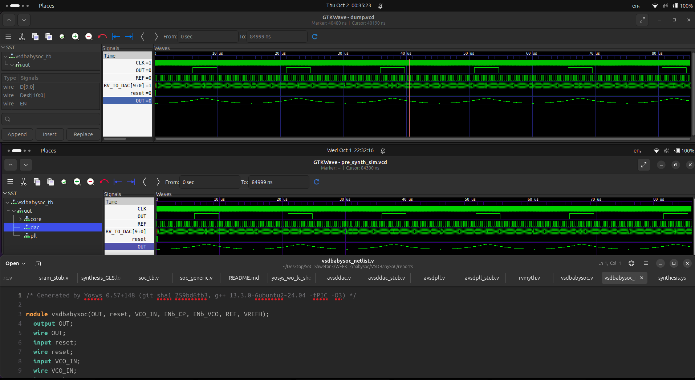
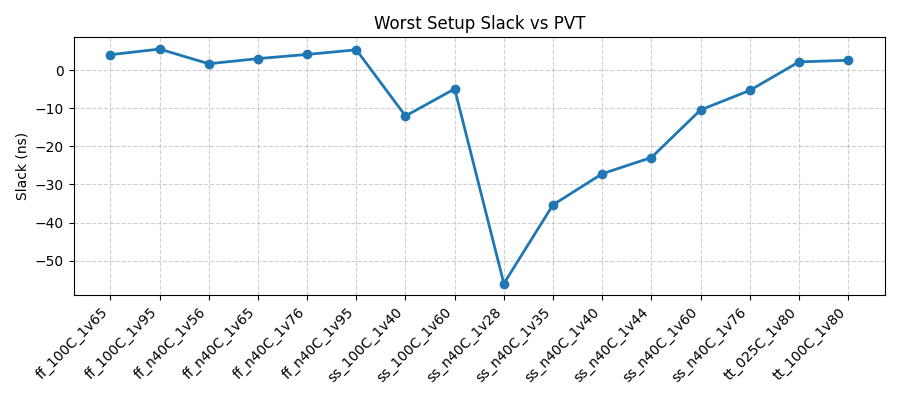
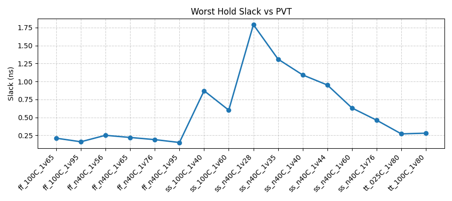
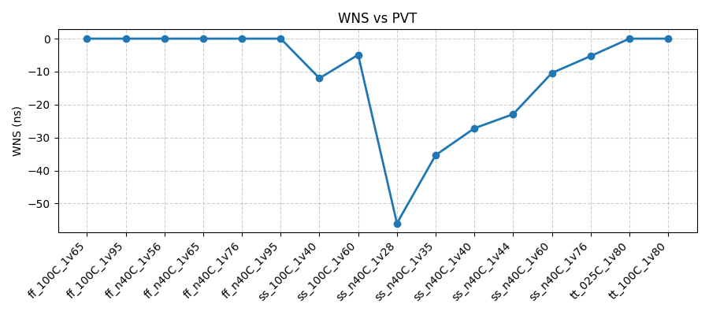
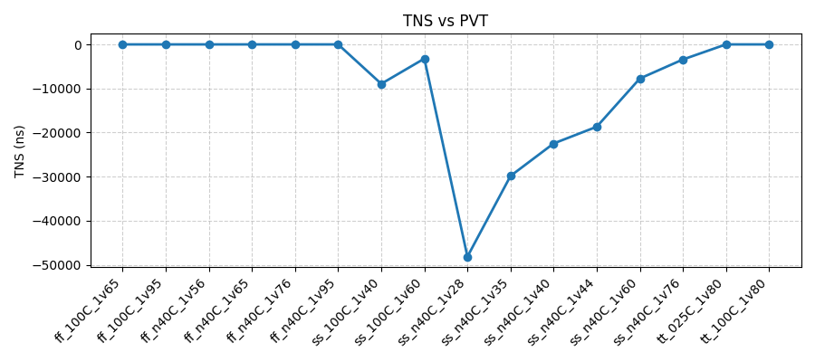
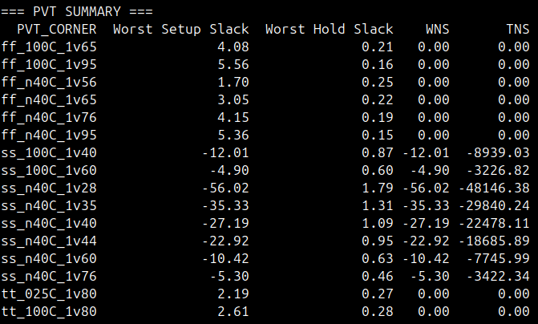
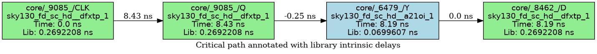
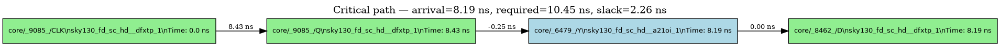

# RTL2GDSII: A Journey into SoC Design

This repository documents my journey through the world of System-on-Chip (SoC) design, from Register Transfer Level (RTL) to a GDSII layout. This project is a part of my learning process to understand the complete VLSI design flow using open-source EDA tools.

## The RTL to GDSII Flow

The RTL to GDSII flow is the process of converting a high-level hardware description into a physical layout ready for manufacturing. This is a complex process that involves several stages:

1.  **RTL Design:** The process starts with a hardware description written in a Hardware Description Language (HDL) like Verilog or VHDL. This is a high-level description of the chip's functionality.

2.  **Synthesis:** The RTL code is synthesized into a gate-level netlist. This netlist is a description of the circuit in terms of logic gates and the connections between them.

3.  **Floorplanning:** This stage involves planning the layout of the chip. This includes defining the chip size, placing the I/O pads, and arranging the major blocks.

4.  **Placement:** The standard cells from the netlist are placed in the floorplan. The goal is to place the cells in a way that minimizes the wire length and congestion.

5.  **Clock Tree Synthesis (CTS):** A clock tree is built to distribute the clock signal to all the sequential elements in the design. The goal is to minimize the clock skew and delay.

6.  **Routing:** The connections between the cells and blocks are made in this stage. This is done in several steps, including global routing and detailed routing.

7.  **Verification:** After routing, the design is verified to ensure that it meets the design rules and that the layout matches the schematic. This includes Design Rule Checking (DRC) and Layout vs. Schematic (LVS) checks.

8.  **GDSII Generation:** Finally, the physical layout is saved in a GDSII file. This file is sent to the foundry for fabrication.

## Table of Contents

*   [Week 0: Tool Installation and Setup](WEEK_0)
*   [Week 1: Introduction to Verilog RTL Design and Synthesis](WEEK_1)
*   [Week 2: SoC Fundamentals and Functional Modelling](WEEK_2)
*   [Week 3: Static Timing Analysis and PVT Corners](WEEK_3)

# VSDBabySoC: Post-Synthesis Verification and Static Timing Analysis using OpenSTA

This document provides a comprehensive walkthrough of the post-synthesis verification and static timing analysis (STA) flow for the `vsdbabysoc` System-on-Chip. The project verifies the gate-level netlist (synthesized as per [WEEK_2/VSDBabySoC/README.md](WEEK_2/VSDBabySoC/README.md)) using Gate-Level Simulation (GLS) and performs STA with OpenSTA to ensure timing closure, validate setup and hold constraints, and identify the critical path limiting performance.

## Table of Contents

0.  [Post-Synthesis Verification (GLS)](#0-post-synthesis-verification-gls)
1.  [STA Flow Overview](#1-sta-flow-overview)
2.  [Key Concept: Timing Constraints and SDC](#2-key-concept-timing-constraints-and-sdc)
3.  [STA Fundamentals](#3-sta-fundamentals)
4.  [The STA Script](#4-the-sta-script)
5.  [Executing STA](#5-executing-sta)
6.  [STA Results](#6-sta-results)
7.  [PVT Corner Analysis](#7-pvt-corner-analysis)
8.  [Timing Analysis and Critical Path Evaluation](#8-timing-analysis-and-critical-path-evaluation)
9.  [Conclusion](#9-conclusion)

## Pre-requisites

- Install OpenSTA, Yosys, Icarus Verilog, and GTKWave. Refer to their respective documentation for installation instructions in WEEK_0 and LOGS.
- Install Sandpiper for Verilog generation from TL-Verilog: rvmyth is in TL-Verilog.

  - **Command**:

    ```bash
    pip3 install pyyaml click sandpiper-saas
    sandpiper-saas -i ./src/module/*.tlv -o rvmyth.v --bestsv --noline -p verilog --outdir ./src/module/
    ```

  - **Note**: The `rvmyth.v` file is generated from `rvmyth.tlv` using Sandpiper. This file is included in the synthesis and simulation processes.

  - **Files**:
    ```bash
    path/to/VSDBabySoC$ tree -a
    .
    ├── assets
    │   ├── STA Theory 
    │   └── STA_1.jpg
    ├── critical_path_improved.png
    ├── critical_path.png
    ├── critical_path_with_lib_delays.png
    ├── logs
    │   ├── LOG_1_PRE_SYNTHESIS_VSDBabySoC.md
    │   ├── LOG_2_POST_SYNTHESIS_VSDBabySoC.md
    │   ├── LOG_3_A_Opensta_Installation_logs.md
    │   ├── LOG_3_STA.md
    │   └── LOG_4_PVT_Corner.md
    ├── pvt_summary.csv
    ├── PVT_Summary.png
    ├── pvt_tns.png
    ├── pvt_wns.png
    ├── pvt_worst_hold.png
    ├── pvt_worst_setup.png
    ├── README.md
    ├── reports
    │   ├── 1_clocks.rpt
    │   ├── 2_unconstrained.rpt
    │   ├── 3_setup_report.rpt
    │   ├── 4_hold_report.rpt
    │   ├── 5_worst_slack.rpt
    │   ├── 6_critical_path_full.rpt
    │   ├── 6_critical_path_full_short.rpt
    │   ├── 6_critical_path.rpt
    │   ├── critical_path.dot
    │   ├── critical_path_improved.dot
    │   ├── critical_path_improved.png
    │   ├── critical_path.png
    │   ├── critical_path_with_lib_delays.dot
    │   ├── critical_path_with_lib_delays_graphviz.png
    │   ├── critical_path_with_lib_delays.png
    │   ├── critical_path_with_lib_delays.txt
    │   └── pvt
    │       ├── ff_100C_1v65
    │       │   ├── 3_setup_summary.rpt
    │       │   ├── 4_hold_summary.rpt
    │       │   ├── 6_critical_path_full_max.rpt
    │       │   ├── 6_critical_path_full_min.rpt
    │       │   ├── tns_hold.rpt
    │       │   ├── tns_setup.rpt
    │       │   ├── units.rpt
    │       │   ├── wns_hold.rpt
    │       │   └── wns_setup.rpt
    │       ├── ff_100C_1v95
    │       ├── ff_n40C_1v56
    │       ├── ff_n40C_1v6
    │       ├── ff_n40C_1v76
    │       ├── ff_n40C_1v95
    │       ├── ss_100C_1v40
    │       ├── ss_100C_1v60
    │       ├── ss_n40C_1v28
    │       ├── ss_n40C_1v35
    │       ├── ss_n40C_1v40
    │       ├── ss_n40C_1v44
    │       ├── ss_n40C_1v60
    │       ├── ss_n40C_1v76
    │       ├── tt_025C_1v80
    │       └── tt_100C_1v80
    │           ├── 3_setup_summary.rpt
    │           ├── 4_hold_summary.rpt
    │           ├── 6_critical_path_full_max.rpt
    │           ├── 6_critical_path_full_min.rpt
    │           ├── tns_hold.rpt
    │           ├── tns_setup.rpt
    │           ├── units.rpt
    │           ├── wns_hold.rpt
    │           └── wns_setup.rpt
    ├── scripts
    │   ├── plot_pvt_sta.py
    │   └── run_sta_per_corner.sh
    ├── STA
    │   ├── final.sdc
    │   ├── run_sta.tcl
    │   ├── sta_per_corner.tcl
    │   └── sta_run.log
    ├── STA_fundamentals_summary.md
    └── VSDBabySoC
        ├── assets
        │   ├── chip_stats.png
        │   ├── comp_pre_vs_post_synth_sim_2.png
        │   ├── comp_pre_vs_post_synth_sim.png
        │   ├── Screenshot from 2025-10-02 00-57-45.png
        │   ├── vsdbabysoc.yosys_show.png
        │   ├── waveform_post_synth_sim.png
        │   ├── waveform_pre_synth_sim_2.png
        │   └── waveform_pre_synth_sim.png
        ├── README.md
        ├── reports
        │   ├── logs
        │   │   └── synthesis_yosis.log
        │   └── vsdbabysoc_netlist.v
        ├── simulation
        │   ├── dump.vcd
        │   ├── post_synth_sim.out
        │   ├── pre_synth_sim.out
        │   └── pre_synth_sim.vcd
        └── src
            ├── gds
            ├── gls_model
            │   ├── primitives.v
            │   └── sky130_fd_sc_hd.v
            ├── include
            ├── layout_conf
            │   ├── rvmyth
            │   └── vsdbabysoc
            ├── lef
            ├── lib
            │   ├── avsddac.lib
            │   ├── avsdpll.lib
            │   └── sky130_fd_sc_hd__tt_025C_1v80.lib
            ├── module
            │   ├── avsddac.v
            │   ├── avsdpll.v
            │   ├── clk_gate.v
            │   ├── rvmyth.v
            │   ├── testbench.v
            │   └── vsdbabysoc.v
            ├── script
            └── sdc
                └── vsdbabysoc_synthesis.sdc

    40 directories, 336 files
    ```

## 0\. Post-Synthesis Verification (GLS)

Post-Synthesis Verification (GLS) was performed as detailed in [WEEK_2/VSDBabySoC/README.md](WEEK_2/VSDBabySoC/README.md), confirming functional equivalence between the RTL and gate-level netlist.



## 1\. STA Flow Overview

The STA process analyzes the timing of the synthesized netlist to ensure it meets timing constraints without setup or hold violations.

  - **Inputs**:
      - Gate-level netlist (`vsdbabysoc_netlist.v`)
      - Technology timing libraries (`.lib` files)
      - SDC constraints file
  - **Tool**: `OpenSTA` Static Timing Analyzer
  - **Output**: Timing reports (setup, hold, critical path)

## 2\. Key Concept: Timing Constraints and SDC

Timing constraints define the operating environment for STA, including clocks, delays, and uncertainties.

#### `STA/final.sdc`

```tcl
# 1. Define the main clock
set clk_targets [get_pins pll/CLK]
if {[llength $clk_targets] == 0} {
    set clk_targets [get_ports core_clk]
    if {[llength $clk_targets] == 0} {
        set clk_targets [get_pins */CLK]
    }
}
create_clock -name core_clk -period 11.0 $clk_targets

# 2. Collect ports
set all_in  [all_inputs]
set all_out [all_outputs]
set non_data_ports [get_ports {REF VCO_IN ENb_CP ENb_VCO reset}]

# 3. Exclude asynchronous control signals (e.g. reset)
set_false_path -from [get_ports reset]

# 4. Define data input ports (exclude non-data ones)
# OpenSTA doesn't support remove_from_collection, so use filter logic
set data_in {}
foreach port $all_in {
    if {[lsearch $non_data_ports $port] == -1} {
        lappend data_in $port
    }
}

# 5. Apply input/output delays
set input_delay_val  [expr {0.3 * 11.0}]
set output_delay_val [expr {0.3 * 11.0}]
set_input_delay  $input_delay_val -clock [get_clocks core_clk] $data_in
set_output_delay $output_delay_val -clock [get_clocks core_clk] $all_out

# 6. Clock uncertainties and transition
set_clock_uncertainty -setup 0.10 [get_clocks core_clk]
set_clock_uncertainty -hold  0.05 [get_clocks core_clk]
set_clock_transition 0.05 [get_clocks core_clk]

# 7. Output loads
set_load 0.02 [all_outputs]
```

- Clock period = 11 ns
- Input/Output delays account for external interfacing.
- Clock uncertainty models jitter.

## 3\. STA Fundamentals

Refer to [STA_fundamentals_summary.md](WEEK_3/STA_fundamentals_summary.md) for a comprehensive summary of STA concepts.

## 4\. The STA Script

We use a TCL script (`STA/run_sta.tcl`) to automate OpenSTA analysis.

#### `STA/run_sta.tcl`

```tcl
# OpenSTA Tcl Script for VSDBabySoC Analysis (final, OpenSTA 2.7.0 compatible)

puts "INFO: Loading libraries..."
read_liberty VSDBabySoC/src/lib/sky130_fd_sc_hd__tt_025C_1v80.lib
read_liberty VSDBabySoC/src/lib/avsddac.lib
read_liberty VSDBabySoC/src/lib/avsdpll.lib

puts "INFO: Reading synthesized netlist..."
read_verilog VSDBabySoC/reports/vsdbabysoc_netlist.v

puts "INFO: Linking design..."
link_design vsdbabysoc

puts "INFO: Reading SDC constraints..."
read_sdc STA/final.sdc

puts "INFO: Generating timing reports..."

# A. Clock listing
report_clock_properties > reports/1_clocks.rpt
puts "A done"

# B. Unconstrained endpoints
report_checks -unconstrained > reports/2_unconstrained.rpt
puts "B done"

# C. Full setup timing (max paths)
report_checks -path_delay max -format full_clock_expanded > reports/3_setup_report.rpt
puts "C done"

# D. Full hold timing (min paths)
report_checks -path_delay min -format full_clock_expanded > reports/4_hold_report.rpt
puts "D done"

# E. Worst slack summary
report_worst_slack -max > reports/5_worst_slack.rpt
puts "E done"

# F. Single worst (critical) path report
report_checks -path_delay max -format short -group_path_count 1 > reports/6_critical_path.rpt
puts "F done"

report_checks -path_delay max -format full_clock_expanded -group_path_count 1 > reports/6_critical_path_full.rpt
report_checks -path_delay max -format full -group_path_count 1 > reports/6_critical_path_full_short.rpt

puts "INFO: Reports written to ./reports/"
puts "INFO: STA script finished successfully."

exit
```

## 5\. Executing STA

With the script ready, STA is run with:

```bash
sta -no_splash STA/run_sta.tcl | tee STA/sta_run.log
```

The full execution log can be found in `STA/sta_run.log`.

## 6\. STA Results

The STA completed successfully, generating timing reports in `reports/`. Key statistics from the reports:

- Clock: core_clk with period 11.00 ns (from 1_clocks.rpt).
- Worst slack (max) (or) WNS: +2.26 ns (from 5_worst_slack.rpt).
- Setup paths: All met with slack +2.26 ns (from 3_setup_report.rpt).
- Hold paths: All met with slack +0.03 ns (from 4_hold_report.rpt).
- No unconstrained paths with violations (from 2_unconstrained.rpt).
- TNS: 0.00 ns (no violations).

Detailed reports:
- `1_clocks.rpt`: Clock properties.
- `2_unconstrained.rpt`: Unconstrained paths (worst case).
- `3_setup_report.rpt`: Setup timing checks.
- `4_hold_report.rpt`: Hold timing checks.
- `5_worst_slack.rpt`: Worst slack summary.
- `6_critical_path.rpt` and `6_critical_path_full.rpt`: Critical path details.

Additional files:
- `run_sta_per_corner.sh` : Script for running STA per corner.
- `plot_pvt_sta.py` : Python script for plotting pvt_summary.csv and plots: pvt_worst_setup.png, pvt_worst_hold.png, pvt_wns.png, pvt_tns.png.
- `generate_timing_graph.py`: Python script for generating timing graphs.
- Graphviz .dot and .png files: Visualizations of critical paths (e.g., critical_path.png, critical_path_improved.png).
- `pvt/`: Folder for PVT variation analysis outputs.

## 7\. PVT Corner Analysis

PVT (Process, Voltage, Temperature) corner analysis is essential for ensuring timing closure across all possible operating conditions in the fabricated chip. Semiconductor manufacturing introduces variations in process parameters (e.g., transistor threshold voltage and mobility), supply voltage fluctuations, and temperature changes, which significantly impact gate delays, slew rates, and overall circuit performance. Without PVT analysis, a design might pass STA at nominal conditions (e.g., typical-typical "tt" corner) but fail in extreme corners, leading to functional or timing failures in real-world deployment.

### Why PVT Analysis is Necessary

- **Process Variations**: Chips from the same design can vary due to fabrication inconsistencies (fast-fast "ff" for optimistic, slow-slow "ss" for pessimistic).
- **Voltage Variations**: Supply voltage (Vdd) affects transistor drive strength; lower voltage slows gates, higher speeds them up.
- **Temperature Effects**: High temperatures increase resistance and reduce mobility (slower gates); low temperatures do the opposite.
- **Multi-Corner Multi-Mode (MCMM) STA**: Analyzes combinations to find the worst-case slack, ensuring robustness across the operating range (e.g., automotive: -40°C to 125°C, 0.8V to 1.2V).

### Commands Used and Explanation

PVT analysis was automated using scripts in `scripts/`. First, clear previous PVT reports:

```bash
rm -rf reports/pvt/*
```

Then, run STA for each PVT corner using `run_sta_per_corner.sh`. This shell script loops over a list of corners, loads the specific liberty file (e.g., `sky130_fd_sc_hd__ss_n40C_1v28.lib` for slow process at -40°C and 1.28V), executes `sta_per_corner.tcl` (which generates setup/hold summaries, WNS/TNS reports, and critical paths), and stores outputs in `reports/pvt/<corner>/`.

```bash
cd WEEK_3 && ./scripts/run_sta_per_corner.sh
```

Example log output (from `LOGS/LOG_7_PVT_Corner.md`):
```
=== Running corner: ff_100C_1v95
    Lib: .../sky130_fd_sc_hd__ff_100C_1v95.lib
INFO: Loaded liberty .../ff_100C_1v95.lib
INFO: Corner ff_100C_1v95 finished. Reports in reports/pvt/ff_100C_1v95
...
All corners processed. Reports are under reports/pvt/
```

Supported corners include ff/ss/tt at various temperatures (-40°C to 100°C) and voltages (1.28V to 1.95V).

Finally, parse results and generate visualizations with `plot_pvt_sta.py`. This Python script reads WNS/TNS from each corner's reports, computes summaries, writes `pvt_summary.csv`, and plots slacks using Matplotlib.

```bash
python3 scripts/plot_pvt_sta.py
```

Example output:
```
=== PVT SUMMARY ===
  PVT_CORNER  Worst Setup Slack  Worst Hold Slack    WNS       TNS
ff_100C_1v65               4.08              0.21   0.00      0.00
...
ss_n40C_1v28             -56.02              1.79 -56.02 -48146.38
...
Wrote pvt_summary.csv and plots: pvt_worst_setup.png, pvt_worst_hold.png, pvt_wns.png, pvt_tns.png
```

### PVT Results and Observations

- **Fast Corners (ff)**: Positive slacks (e.g., ff_n40C_1v95: setup +5.36 ns), no violations.
- **Typical Corners (tt)**: Nominal performance (tt_025C_1v80: setup +2.19 ns).
- **Slow Corners (ss)**: Violations in extreme conditions (ss_n40C_1v28: WNS -56.02 ns, TNS -48146.38 ns), indicating need for optimizations like cell sizing or VT swapping.
- All hold slacks positive, suggesting hold fixes (e.g., via buffers) may suffice if focusing on setup.

Reports stored in `reports/pvt/<corner>/` (e.g., `wns_setup.rpt`, `tns_hold.rpt`). Full summary in `pvt_summary.csv`.







## 8\. Timing Analysis and Critical Path Evaluation

### Setup Path Analysis

From `reports/3_setup_report.rpt`:

```log
Startpoint: core/_9085_ (rising edge-triggered flip-flop clocked by core_clk)
Endpoint: core/_8462_ (rising edge-triggered flip-flop clocked by core_clk)
Path Group: core_clk
Path Type: max

  Delay    Time   Description
---------------------------------------------------------
   0.00    0.00   clock core_clk (rise edge)
   0.00    0.00   clock network delay (ideal)
   0.00    0.00 ^ core/_9085_/CLK (sky130_fd_sc_hd__dfxtp_1)
   8.43    8.43 ^ core/_9085_/Q (sky130_fd_sc_hd__dfxtp_1)
  -0.25    8.19 v core/_6479_/Y (sky130_fd_sc_hd__a21oi_1)
   0.00    8.19 v core/_8462_/D (sky130_fd_sc_hd__dfxtp_1)
           8.19   data arrival time

  11.00   11.00   clock core_clk (rise edge)
   0.00   11.00   clock network delay (ideal)
   0.00   11.00   clock reconvergence pessimism
          11.00 ^ core/_8462_/CLK (sky130_fd_sc_hd__dfxtp_1)
  -0.55   10.45   library setup time
          10.45   data required time
---------------------------------------------------------
          10.45   data required time
          -8.19   data arrival time
---------------------------------------------------------
           2.26   slack (MET)
```

**Setup Slack Formula:**

Slack_setup = Required Time - Arrival Time = 10.45 - 8.19 = +2.26 ns

✅ Setup timing met.

### Hold Path Analysis

From `reports/4_hold_report.rpt`:

```log
Startpoint: reset (input port clocked by core_clk)
Endpoint: core/_9088_ (rising edge-triggered flip-flop clocked by core_clk)
Path Group: core_clk
Path Type: min

  Delay    Time   Description
---------------------------------------------------------
   0.00    0.00   clock core_clk (rise edge)
   0.00    0.00   clock network delay (ideal)
   0.00    0.00 ^ input external delay
   0.00    0.00 ^ reset (in)
   0.00    0.00 ^ core/_9088_/D (sky130_fd_sc_hd__dfxtp_1)
           0.00   data arrival time

   0.00    0.00   clock core_clk (rise edge)
   0.00    0.00   clock network delay (ideal)
   0.00    0.00   clock reconvergence pessimism
           0.00 ^ core/_9088_/CLK (sky130_fd_sc_hd__dfxtp_1)
  -0.03   -0.03   library hold time
          -0.03   data required time
---------------------------------------------------------
          -0.03   data required time
          -0.00   data arrival time
---------------------------------------------------------
           0.03   slack (MET)
```

**Hold Slack Formula:**

Slack_hold = Arrival Time - Required Time = 0.00 - (-0.03) = +0.03 ns

✅ Hold timing met.

### Critical Path Evaluation

The critical path is the longest delay path, limiting clock speed. From `reports/6_critical_path_full.rpt`:

```log
Startpoint: core/_9085_ (rising edge-triggered flip-flop clocked by core_clk)
Endpoint: core/_8462_ (rising edge-triggered flip-flop clocked by core_clk)
Path Group: core_clk
Path Type: max

  Delay    Time   Description
---------------------------------------------------------
   0.00    0.00   clock core_clk (rise edge)
   0.00    0.00   clock network delay (ideal)
   0.00    0.00 ^ core/_9085_/CLK (sky130_fd_sc_hd__dfxtp_1)
   8.43    8.43 ^ core/_9085_/Q (sky130_fd_sc_hd__dfxtp_1)
  -0.25    8.19 v core/_6479_/Y (sky130_fd_sc_hd__a21oi_1)
   0.00    8.19 v core/_8462_/D (sky130_fd_sc_hd__dfxtp_1)
           8.19   data arrival time

  11.00   11.00   clock core_clk (rise edge)
   0.00   11.00   clock network delay (ideal)
   0.00   11.00   clock reconvergence pessimism
          11.00 ^ core/_8462_/CLK (sky130_fd_sc_hd__dfxtp_1)
  -0.55   10.45   library setup time
          10.45   data required time
---------------------------------------------------------
          10.45   data required time
          -8.19   data arrival time
---------------------------------------------------------
           2.26   slack (MET)
```

- Critical path dominated by combinational logic (8.19 ns delay).
- Achievable frequency ≈ 90.9 MHz (1 / (11.0 ns - 2.26 ns slack) ≈ 90.9 MHz).
- Visualizations: reports/critical_path.png, reports/critical_path_improved.png, reports/critical_path_with_lib_delays.png.
- Graphviz .dot files: critical_path.dot, critical_path_improved.dot, etc.
- Parsed data in reports/parsed_critical_path_full.txt.




## 9\. Conclusion

This process successfully verified the `vsdbabysoc` gate-level netlist through GLS and STA. Timing closure was achieved with positive slacks for setup and hold checks. The critical path was identified, confirming the design's performance limits.
