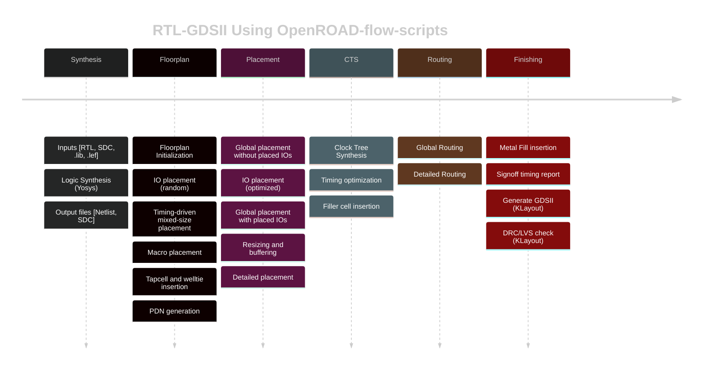

# RTL2GDSII: A Journey into SoC Design

This repository documents my journey through the world of System-on-Chip (SoC) design, from Register Transfer Level (RTL) to a GDSII layout. This project is a part of my learning process to understand the complete VLSI design flow using open-source EDA tools.



## The RTL to GDSII Flow

The RTL to GDSII flow is the process of converting a high-level hardware description into a physical layout ready for manufacturing. This is a complex process that involves several stages:

1.**RTL Design:** The process starts with a hardware description written in a Hardware Description Language (HDL) like Verilog or VHDL. This is a high-level description of the chip's functionality.

2.**Synthesis:** The RTL code is synthesized into a gate-level netlist. This netlist is a description of the circuit in terms of logic gates and the connections between them.

3.**Floorplanning:** This stage involves planning the layout of the chip. This includes defining the chip size, placing the I/O pads, and arranging the major blocks.

4.**Placement:** The standard cells from the netlist are placed in the floorplan. The goal is to place the cells in a way that minimizes the wire length and congestion.

5.**Clock Tree Synthesis (CTS):** A clock tree is built to distribute the clock signal to all the sequential elements in the design. The goal is to minimize the clock skew and delay.

6.**Routing:** The connections between the cells and blocks are made in this stage. This is done in several steps, including global routing and detailed routing.

7.**Verification:** After routing, the design is verified to ensure that it meets the design rules and that the layout matches the schematic. This includes Design Rule Checking (DRC) and Layout vs. Schematic (LVS) checks.

8.**GDSII Generation:** Finally, the physical layout is saved in a GDSII file. This file is sent to the foundry for fabrication.

## Table of Contents

* [Week 0: Tool Installation and Setup](WEEK_0)
* [Week 1: Introduction to Verilog RTL Design and Synthesis](WEEK_1)
* [Week 2: SoC Fundamentals and Functional Modelling](WEEK_2)
* [Week 3: Static Timing Analysis and PVT Corners](WEEK_3)
* [Week 4: CMOS Inverter Static Behavior Evaluation and SPICE Simulations](WEEK_4)
* [Week 5: OpenROAD Flow Setup and Floorplan + Placement](WEEK_5)
* [Week 6: Physical Design Labs using OpenLANE and Sky130 PDK](WEEK_6)
* [Week 7: BabySoC Design](WEEK_7)

# Physical Design of BabySoC using OpenROAD and Sky130 PDK

## Objective

To execute a complete physical design flow for the `vsdbabysoc` design using the OpenROAD toolchain with the Sky130 PDK. This involves a full RTL-to-GDSII implementation, including synthesis, floorplanning, power planning, placement, clock tree synthesis, routing, parasitic extraction (SPEF), and final signoff checks. The goal is to experience a real SoC backend flow, connecting RTL design with physical implementation, and understanding the impact of physical constraints on timing, power, and area (PPA).

## Table of Contents

* [Objective](#objective)
* [Why This Task Is Important](#why-this-task-is-important)
* [Prerequisites](#prerequisites)
* [Setup of VSDBabySoC in OpenROAD Flow Scripts Directory](#setup-of-vsdbabysoc-in-openroad-flow-scripts-directory)
* [Introduction to config.mk in OpenROAD Flow](#introduction-to-configmk-in-openroad-flow)
* [Implementation](#implementation)
  * [1. Environment and Design Setup](#1-environment-and-design-setup)
  * [2. Synthesis](#2-synthesis)
  * [3. Floorplanning and Power Distribution Network (PDN)](#3-floorplanning-and-power-distribution-network-pdn)
  * [4. Placement](#4-placement)
  * [5. Clock Tree Synthesis (CTS)](#5-clock-tree-synthesis-cts)
  * [6. Routing](#6-routing)
  * [7. Parasitic Extraction (SPEF)](#7-parasitic-extraction-spef)
* [Task Reference](#task-reference)
* [Acknowledgements](#acknowledgements)

* Verification of Outputs generated at various stages of the flow:


## Why This Task Is Important

This week’s task integrates all prior concepts into a complete physical design flow for a real System-on-Chip, the BabySoC.

* **End-to-End Flow Mastery**: It provides hands-on experience with the entire RTL-to-GDSII process, connecting logical design with physical implementation.
* **Impact of Physical Constraints**: You will learn how floorplan decisions, placement density, and routing choices directly affect the chip's timing, power, and area (PPA).
* **Parasitic Extraction and STA**: This task highlights the importance of post-route parasitic extraction (SPEF) for accurate static timing analysis (STA), which is crucial for verifying that the chip will function at the desired speed. SPEF captures real parasitic R and C values for signoff-level timing analysis.
* **Mixed-Signal Integration**: VSDBabySoC includes analog macros (PLL and DAC), making this a comprehensive example of mixed-signal physical design.

## Prerequisites

* Install OpenROAD, Yosys, and GTKWave. Refer to their respective documentation for installation instructions.
* Install Sandpiper for Verilog generation from TL-Verilog: rvmyth is in TL-Verilog.

```bash
pip3 install pyyaml click sandpiper-saas
sandpiper-saas -i ./src/module/*.tlv -o rvmyth.v --bestsv --noline -p verilog --outdir ./src/module/
```

* Clone and set up OpenROAD-flow-scripts (ORFS) for automated physical design flow.

## Setup of VSDBabySoC in OpenROAD Flow Scripts Directory

Before starting synthesis, floorplanning, placement, and routing, you must properly add the BabySoC design directories into the official OpenROAD-flow-scripts environment.

**Below are the mandatory setup steps.**

```bash
OpenROAD-flow-scripts/
└── flow/
    └── designs/
        └── sky130hd/
            └── vsdbabysoc/
                │
                ├── config.mk                   # Main OpenROAD flow config
                ├── vsdbabysoc_synthesis.sdc    # Synthesis constraints file
                ├── macro.cfg                   # Macro placement configuration
                ├── pin_order.cfg               # Pin placement order file
                │
                ├── src/                        # RTL source files for VSDBabySoC
                │   ├── vsdbabysoc.v
                │   ├── rvmyth.v
                │   ├── rvmyth_gen.v
                │   ├── clk_gate.v
                │   ├── avsddac.v
                │   └── avsdpll.v
                │
                ├── include/                    # SandPiper-generated header files
                │   ├── sandpiper.vh
                │   ├── sandpiper_gen.vh
                │   ├── sp_default.vh
                │   └── sp_verilog.vh
                │
                ├── gds/                        # Macro GDS files
                │   ├── avsddac.gds
                │   └── avsdpll.gds
                │
                ├── lef/                        # Macro LEF files
                │   ├── avsddac.lef
                │   └── avsdpll.lef
                │
                └── lib/                        # Macro Liberty timing files
                    ├── avsddac.lib
                    └── avsdpll.lib
```

## Introduction to config.mk in OpenROAD Flow

Before starting the physical design (back-end flow) in OpenROAD, the tool must know what design we are working on, where all the design files are kept, and what external IPs or macros the SoC uses.
This information is not detected automatically — we have to explicitly specify it.

This is done using a file called `config.mk`.

The `config.mk` file acts as the central configuration file for a custom design inside OpenROAD-flow-scripts. It provides all the paths and parameters required for:

a. RTL synthesis
b. Macro integration (DAC, PLL, etc.)
c. Constraint loading
d. Placement and routing setup
e. Output directory creation

**In simple words:**

* `config.mk` is the file that tells OpenROAD “this is my design, these are my RTL files, these are my macros, and this is how you should run the flow.”

* Without this file, OpenROAD will not know:
    Which Verilog files to synthesize
    Which IP blocks (macros) to include
    Where LEF/GDS/LIB files are stored
    What timing constraints to apply
    What top module to pick

Thus, `config.mk` is essential to correctly registering your design inside the OpenROAD-flow-scripts directory structure and ensuring that the entire PnR flow runs with the right inputs.

[Complete config.mk file used for VSDBabySoC:](config.mk)

## Implementation

### 1. Environment and Design Setup

Set up OpenROAD-flow-scripts:

```bash
# Clone ORFS
git clone --recursive https://github.com/The-OpenROAD-Project/OpenROAD-flow-scripts
cd OpenROAD-flow-scripts

# Setup dependencies
sudo ./setup.sh

# Build OpenROAD locally
./build_openroad.sh --local

# Source environment
source ./env.sh
```

Verify installation:

```bash
yosys -help
openroad -help
cd flow
make
```

### 2. Synthesis

Synthesis translates the RTL Verilog code into a gate-level netlist using standard cells from the Sky130 library. Use the OpenROAD flow for synthesis.

```bash
make DESIGN_CONFIG=./designs/sky130hd/vsdbabysoc/config.mk synth
```

This generates the gate-level netlist and reports synthesis statistics, including cell count and area.

Screenshots of synthesis:


### 3. Floorplanning and Power Distribution Network (PDN)

Floorplanning defines the die and core areas, places I/O pads, and sets up the power distribution network.

```bash
make DESIGN_CONFIG=./designs/sky130hd/vsdbabysoc/config.mk floorplan
```

To view the floorplan:

```bash
make DESIGN_CONFIG=./designs/sky130hd/vsdbabysoc/config.mk gui_floorplan
```

Screenshots of floorplan setup:


### 4. Placement

Placement positions the standard cells and macros within the core area.

```bash
make DESIGN_CONFIG=./designs/sky130hd/vsdbabysoc/config.mk place
```

To view placement and congestion:

```bash
make DESIGN_CONFIG=./designs/sky130hd/vsdbabysoc/config.mk gui_place
```

Screenshots of placement:


### 5. Clock Tree Synthesis (CTS)

CTS balances clock delays to minimize skew.

```bash
make DESIGN_CONFIG=./designs/sky130hd/vsdbabysoc/config.mk cts
```

Post-CTS timing reports are generated, including WNS, TNS, and violations.

[To view CTS results:](WEEK_7/assets/reports/4_cts_final.rpt)

Screenshots of CTS:


### 6. Routing

Routing connects all nets using metal layers.

```bash
make DESIGN_CONFIG=./designs/sky130hd/vsdbabysoc/config.mk route
```

To view the routed layout:

```bash
make DESIGN_CONFIG=./designs/sky130hd/vsdbabysoc/config.mk gui_route
```

This is the most critical phase. The design fails with [ERROR GRT-0116] Global routing finished with congestion.

* Screenshots of routing attempts:


* After making changes into the [config.mk](config.mk) managed to reduce to the following:


* Finally, the routing was completed successfully without congestion errors:


* Final routing Screenshots:


* The Fix:

<details>
<summary>Expand to Read Fix Details</summary>

# VSDBabySoC Global Routing Failure: Root Cause Analysis & Resolution

## Executive Summary

A VSDBabySoC design using OpenROAD-flow-scripts with Sky130 PDK was failing at the global routing stage (5_1_grt) with congestion overflow errors. The root cause was identified as **pin accessibility obstructions in the analog macro LEF files**, specifically metal layer obstructions blocking router access to macro pins.

---

## 1. Initial Problem Statement

### Error Message

```bash
[ERROR GRT-0116] Global routing finished with congestion.
Check the congestion regions in the DRC Viewer.
```

### Symptoms

* Global routing completed but reported overflow violations
* Total overflow count: 18 violations across met3, met4, and met5
* Design utilization was only 13% (not a density issue)
* Routing resources appeared adequate (~1-2% usage on most layers)

---

## 2. Investigation Process

### Phase 1: Initial Configuration Analysis

The original `config.mk` had aggressive routing settings:

```makefile
export PLACE_DENSITY   = 0.30
export MACRO_PLACE_HALO    = 20 20
export MACRO_PLACE_CHANNEL = 40 40
export GRT_LAYER_ADJUSTMENTS = {met1:0.15,met2:0.12,met3:0.10,met4:0.08,met5:0.05}
```

These settings appeared reasonable for a 13% utilization design.

### Phase 2: Congestion Report Analysis

The congestion report revealed the critical insight:

```rpt
violation type: Horizontal congestion
    srcs: net:RV_TO_DAC\[9\]
    comment: capacity:0 usage:1 overflow:1
    bbox = (1090.2000, 579.6000) - (1097.1000, 586.5000) on Layer -
```

**Key observation:** `capacity:0` indicated the router had **zero legal routing tracks** in these regions, not just high congestion.

### Phase 3: LEF File Inspection

Examining `avsddac.lef` revealed the root cause:

#### Problem 1: OUT Pin Access Blocked by met4 OBS

```lef
PIN OUT
    PORT
      LAYER met4 ;
        RECT 1172.680 1127.710 1173.730 1175.360 ;
    END
END OUT

OBS
    LAYER met4 ;
        RECT 154.520 1171.010 1172.280 1175.050 ;  ← Ends at x=1172.280
        RECT 1174.130 1127.310 1188.200 1175.050 ; ← Starts at x=1174.130
```

The OUT pin (x: 1172.680-1173.730) was squeezed between obstructions with only ~0.4µm clearance on each side—insufficient for routing.

#### Problem 2: D[8] and D[9] Pins Only on li1 Layer

```lef
PIN D[8]
    PORT
      LAYER li1 ;
        RECT 1117.200 613.050 1117.850 709.180 ;
    END

PIN D[9]
    PORT
      LAYER li1 ;
        RECT 1150.220 613.050 1151.250 755.620 ;
    END
```

The li1 layer has effectively **zero routing capacity** in Sky130:

```lef
li1        Vertical            0            10          0.00%
```

#### Problem 3: Massive met1 Obstruction

```lef
LAYER met1 ;
    RECT 140.750 613.050 1313.360 1168.430 ;  ← Covers entire macro interior
```

This blocked any met1 access to the li1-only pins.

---

## 3. Resolution Strategy

### Fix 1: Widen met4 OBS Gap for OUT Pin

**Before:**

```lef
LAYER met4 ;
    RECT 154.520 1171.010 1172.280 1175.050 ;
    RECT 1174.130 1127.310 1188.200 1175.050 ;
```

**After:**

```lef
LAYER met4 ;
    RECT 154.520 1171.010 1168.000 1175.050 ;  ← Moved left edge back
    RECT 1178.000 1127.310 1188.200 1175.050 ; ← Moved right edge forward
```

This created a ~10µm routing corridor around the OUT pin instead of ~1.85µm.

### Fix 2: Add met1 Access Points for D[8] and D[9] Pins

**Before:**

```lef
PIN D[8]
    PORT
      LAYER li1 ;
        RECT 1117.200 613.050 1117.850 709.180 ;
    END
END D[8]
```

**After:**

```lef
PIN D[8]
    PORT
      LAYER li1 ;
        RECT 1117.200 613.050 1117.850 709.180 ;
      LAYER met1 ;
        RECT 1115.000 608.000 1120.000 613.050 ;  ← NEW: Access below OBS
    END
END D[8]
```

The new met1 shapes extend **below** y=613.050, outside the met1 obstruction boundary, giving the router legal access paths.

---

## 4. Technical Explanation

### Why This Happens

Analog macros (DAC, PLL) are often created with:

1. **Pins on lower metal layers (li1)** for analog signal integrity
2. **Large obstructions** to protect internal routing from interference
3. **Minimal consideration for digital router requirements**

OpenROAD's TritonRoute requires:

1. Legal access points to every pin
2. Sufficient routing capacity on accessible layers
3. Clear paths from pin access points to the routing grid

### The Pin Access Problem Illustrated

```text
                    ┌─────────────────────────────────┐
                    │         met1 OBS                │
                    │   (blocks entire interior)      │
                    │                                 │
    Router cannot   │    ┌──────┐                     │
    reach pin! ─────│───►│D[8]  │ (li1 only)          │
                    │    │ pin  │                     │
                    │    └──────┘                     │
                    │                                 │
                    └─────────────────────────────────┘
                    y = 613.050 ─────────────────────────

    SOLUTION: Add met1 shape BELOW y=613.050

                    ┌─────────────────────────────────┐
                    │         met1 OBS                │
                    │                                 │
                    │    ┌──────┐                     │
                    │    │D[8]  │ (li1)               │
                    │    │ pin  │                     │
                    │    └─┬────┘                     │
                    └──────│──────────────────────────┘
                    ═══════╪═══════  y = 613.050
                        ┌──┴───┐
    Router can now ────►│ met1 │ (new access point)
    reach pin!          │access│
                        └──────┘
```

---

## 5. Results

### Before Fix

```bash
[ERROR GRT-0116] Global routing finished with congestion.
Total Overflow: 29 violations
```


### After Fix

```bash
[INFO GRT-0018] Total wirelength: 407106 um
[INFO GRT-0014] Routed nets: 6450
[INFO ANT-0002] Found 0 net violations.
[INFO ANT-0001] Found 0 pin violations.
Design area 728556 um^2 13% utilization.
```


---

## 6. Key Lessons Learned

### For Physical Design Engineers

1. **Always verify macro pin accessibility** - Check that pins have routing access on layers the router can use

2. **Understand layer routing capacity** - li1 in Sky130 has near-zero routing capacity; pins must have met1+ access

3. **Inspect OBS sections carefully** - Obstructions can inadvertently block pin access even with sufficient apparent clearance

4. **Use congestion reports effectively** - `capacity:0` indicates physical blockage, not just high utilization

### For Analog Macro Designers

1. **Provide multi-layer pin definitions** - Include met1 or met2 access shapes for all pins

2. **Create routing channels** - Leave gaps in obstructions near pin locations

3. **Document routing requirements** - Specify minimum halo sizes and routing layer requirements

---

## 7. Verification Commands

To verify the fix worked:

```bash
# View the routed design
make gui_route DESIGN_CONFIG=designs/sky130hd/VSDBabySoC/config.mk

# Check for DRC violations
make drc DESIGN_CONFIG=designs/sky130hd/VSDBabySoC/config.mk

# Generate final reports
make report DESIGN_CONFIG=designs/sky130hd/VSDBabySoC/config.mk
```

---

## 8. Files Modified

| File | Change |
|------|--------|
| `avsddac.lef` | Widened met4 OBS gap around OUT pin; Added met1 access shapes to D[8], D[9] pins |
| `config.mk` | Increased MACRO_PLACE_HALO and MACRO_PLACE_CHANNEL (optional) |
| `macro.cfg` | Repositioned macros away from die edges (optional) |

---

## 9. Conclusion

This routing failure exemplifies a common challenge in mixed-signal SoC design: analog macros created without consideration for digital place-and-route requirements. The fix required understanding both the analog macro's physical structure and the digital router's access requirements. By adding appropriate metal layer access points and clearing obstruction blockages, the design achieved zero routing violations with minimal impact to the original macro functionality.

</details>

### 7. Parasitic Extraction (SPEF)

Extract parasitics for accurate post-route STA.

SPEF (Standard Parasitic Exchange Format) contains the real, extracted parasitic R and C values for every net. This is essential for signoff STA, as pre-route estimates are inaccurate.

Use the following TCL script for extraction:

```tcl
# Extraction
if { $rcx_rules_file != "" } {
  define_process_corner -ext_model_index 0 X
  extract_parasitics -ext_model_file $rcx_rules_file

  set spef_file [make_result_file ${design}_${platform}.spef]
  write_spef $spef_file

  read_spef $spef_file
} else {
  # Use global routing based parasitics in lieu of rc extraction
  estimate_parasitics -global_routing
}
```


## Task Reference

* [VSD BabySoC](https://github.com/manili/VSDBabySoC.git)
* [BabySoC Simulation](https://github.com/Subhasis-Sahu/BabySoC_Simulation.git)
* [ASIC Design](https://github.com/Akash-Perla/ASIC-Design.git)

## Acknowledgements

* [Kunal Ghosh](https://github.com/kunalg123), Co-founder, VSD Corp. Pvt. Ltd.
* [Nickson P Jose](https://github.com/nickson-jose), Physical Design Engineer, Intel Corporation.
* [R. Timothy Edwards](https://github.com/RTimothyEdwards), Senior Vice President of Analog and Design, efabless Corporation.
* [Fayiz Ferosh](https://github.com/fayizferosh/soc-design-and-planning-nasscom-vsd/blob/main/README.md)
