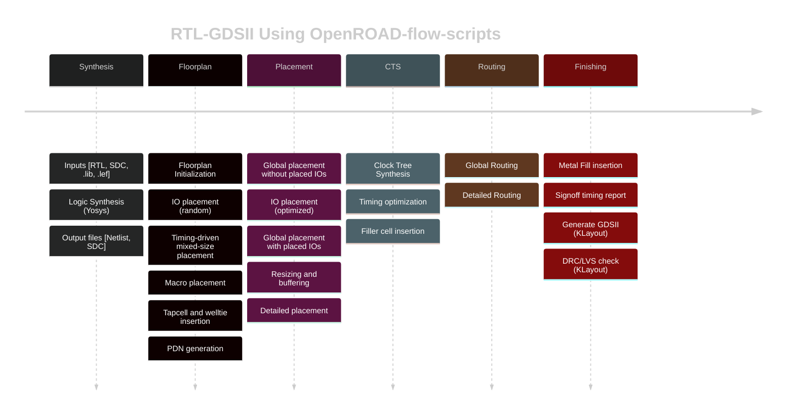

# RTL2GDSII: A Journey into SoC Design

This repository documents my journey through the world of System-on-Chip (SoC) design, from Register Transfer Level (RTL) to a GDSII layout. This project is a part of my learning process to understand the complete VLSI design flow using open-source EDA tools.

## The RTL to GDSII Flow

The RTL to GDSII flow is the process of converting a high-level hardware description into a physical layout ready for manufacturing. This is a complex process that involves several stages:

1.**RTL Design:** The process starts with a hardware description written in a Hardware Description Language (HDL) like Verilog or VHDL. This is a high-level description of the chip's functionality.

2.**Synthesis:** The RTL code is synthesized into a gate-level netlist. This netlist is a description of the circuit in terms of logic gates and the connections between them.

3.**Floorplanning:** This stage involves planning the layout of the chip. This includes defining the chip size, placing the I/O pads, and arranging the major blocks.

4.**Placement:** The standard cells from the netlist are placed in the floorplan. The goal is to place the cells in a way that minimizes the wire length and congestion.

5.**Clock Tree Synthesis (CTS):** A clock tree is built to distribute the clock signal to all the sequential elements in the design. The goal is to minimize the clock skew and delay.

6.**Routing:** The connections between the cells and blocks are made in this stage. This is done in several steps, including global routing and detailed routing.

7.**Verification:** After routing, the design is verified to ensure that it meets the design rules and that the layout matches the schematic. This includes Design Rule Checking (DRC) and Layout vs. Schematic (LVS) checks.

8.**GDSII Generation:** Finally, the physical layout is saved in a GDSII file. This file is sent to the foundry for fabrication.

## Table of Contents

* [Week 0: Tool Installation and Setup](WEEK_0)
* [Week 1: Introduction to Verilog RTL Design and Synthesis](WEEK_1)
* [Week 2: SoC Fundamentals and Functional Modelling](WEEK_2)
* [Week 3: Static Timing Analysis and PVT Corners](WEEK_3)
* [Week 4: CMOS Inverter Static Behavior Evaluation and SPICE Simulations](WEEK_4)
* [Week 5: OpenROAD Flow Setup and Floorplan + Placement](WEEK_5)
* [Week 6: Physical Design Labs using OpenLANE and Sky130 PDK](WEEK_6)
* [Week 7: BabySoC Design](WEEK_7)
* [Week 8: Final Project - Custom SoC Design & PVT corners](WEEK_8)

## References and Acknowledgments

### Technical References

1. **OpenROAD Documentation:** https://openroad.readthedocs.io/
2. **SkyWater PDK:** https://skywater-pdk.readthedocs.io/
3. **Yosys Manual:** https://yosyshq.readthedocs.io/
4. **Magic Layout Tool:** http://opencircuitdesign.com/magic/
5. **RISC-V ISA Specification:** https://riscv.org/technical/specifications/

### Open-Source Tools

- **OpenROAD:** RTL-to-GDSII flow automation
- **Yosys:** Logic synthesis framework
- **OpenSTA:** Static timing analyzer
- **Magic:** VLSI layout tool
- **ngspice:** SPICE circuit simulator
- **Icarus Verilog:** Verilog simulator
- **GTKWave:** Waveform viewer

### Course Materials

- VSD - VLSI System Design
- RISC-V Reference SoC Tapeout Program

---

**Last Updated:** November 25, 2025  
**Author:** Shwetank Shekhar  
**Contact:** shwetankshekharcode@gmail.com 
**GitHub:** https://github.com/ShekharShwetank

---

*This repository represents original work completed as part of the RISC-V Reference SoC Tapeout Program at IIT Gandhinagar. All terminal screenshots display username `ank@shwetank-shekhar` or `shwetank@shwetank-VirtualBox` for verification purposes.*
