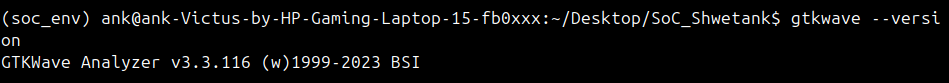
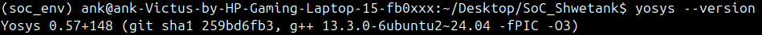
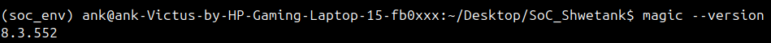
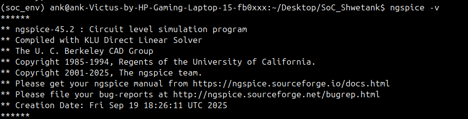
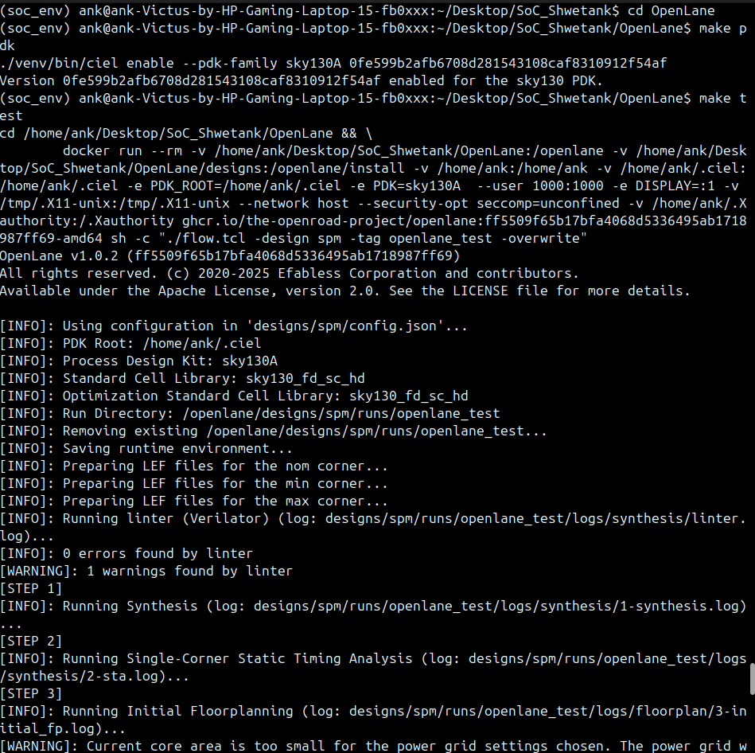
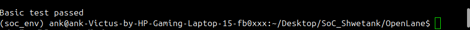
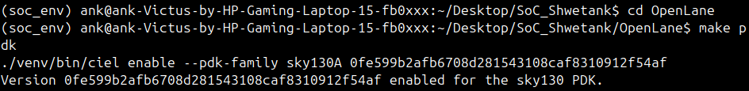

# Week 0: Tool Installation and Setup

This week was focused on setting up the environment and installing all the necessary tools for the RTL to GDSII flow.

[Check out the detailed environment setup guide here.](Environment_setup.md)
[Automated Installation Script here.](Shell_Scripts/INSTALL_OPEN_SOURCE_TOOLS.sh)
[Automated Verification Script here.](Shell_Scripts/VERIFY_INSTALLATION.sh)
[Installation Verification Logs here.](Installation_Verification_Logs.md)

## Tools Installed

### Icarus Verilog

Icarus Verilog is a Verilog simulation and synthesis tool. It operates as a compiler, compiling source code written in Verilog (IEEE-1364) into some target format.

### GTKWave

GTKWave is a fully featured GTK+ based wave viewer for Unix, Win32, and Mac OSX which reads LXT, LXT2, VZT, FST, and GHW files as well as standard Verilog VCD/EVCD files and allows their viewing.

### Yosys

Yosys is a framework for Verilog RTL synthesis. It currently has extensive Verilog-2005 support and provides a basic set of synthesis algorithms for various application domains.

### Magic

Magic is a venerable VLSI layout tool, written in the 1980s at UC Berkeley by John Ousterhout. It's still widely used in academia and for small projects.

### ngspice

Ngspice is a mixed-level/mixed-signal circuit simulator. Its code is based on three open source software packages: Spice3f5, Cider1b1 and Xspice.

### OpenLane

OpenLane is an automated RTL to GDSII flow based on several components including OpenROAD, Yosys, Magic, Netgen, CVC, SPEF-Extractor, KLayout and a number of custom scripts for design exploration and optimization.

### PDK

The Process Design Kit (PDK) provides the necessary technology files for the tools to understand the manufacturing process.

## Installation Verification Logs

The logs for the verification of each tool installation can be found in the [Installation_Verification_Logs.md](Installation_Verification_Logs.md) file.
