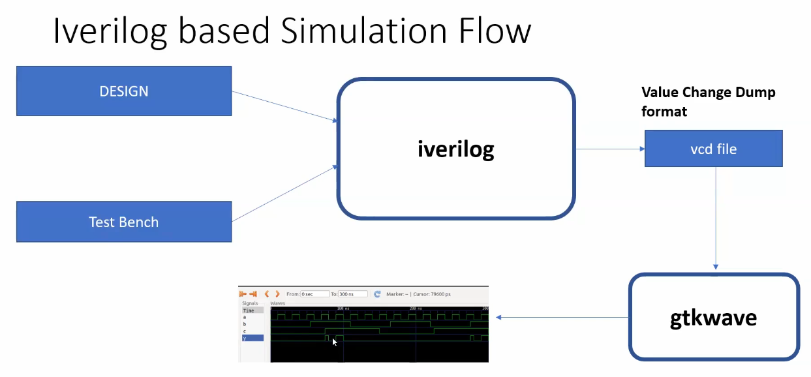
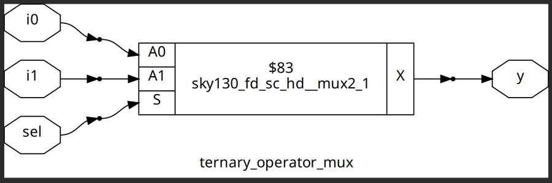
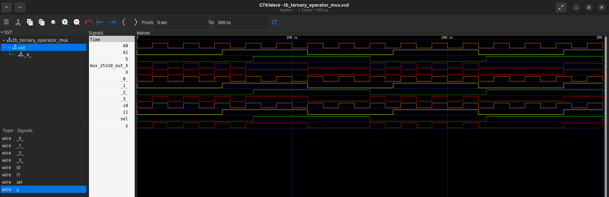
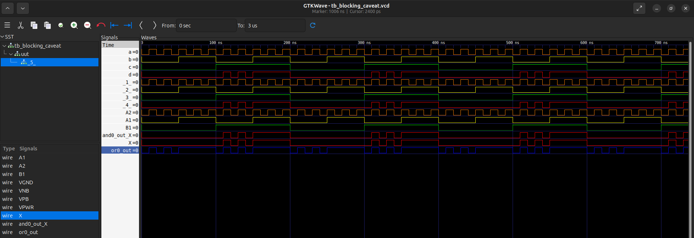

# Week 1: RTL Design and Synthesis

This week focuses on the fundamentals of RTL design using Verilog, simulation, and logic synthesis.

## Design and Synthesis Flow

The overall flow involves designing in RTL, simulating to verify functionality, synthesizing the RTL into a gate-level netlist using a standard cell library, and finally performing a Gate Level Simulation (GLS) to ensure the synthesized netlist is functionally correct.

---

## Day 1: Introduction to Verilog RTL Design and Synthesis

Commands to run iverilog and gtkwave, the comparison between top modules, module structures, and the contents:

- **Top level module file**:
  Data types, assignments, verilog constructs, hierarchal design principle, instantiations, sequential and combinational, procedural blocks, synthesizeable and non-synthesizable verilog code.

- **Test Bench**:
  Stimulus generators and stimulus observers.

- **Key knowledge**:
  - Difference between reg, wire, and others.
  - typedef, parameter.
  - case statements, if-else, loops etc.

- **Intro to yosys**:
  - Synthesizer: converts RTL to netlist.
  - ip: design_file and *.lib file.
  - yosys: synthesizer.
  - op: netlist file.

> commands:
```
read_verilog: to read design file
read_liberty: to read library
write_verilog: to generate the output file
```

### Verify if synthesis is correct?

1. ip: gen_netlist & tb
   - tool: iverilog
   - op: vcd file
2. ip: vcd file
   - tool: gtkwave
   - op: waveform


4. BOTH WAVEFORMS SHOULD BE SAME: RTL AND NETLIST



### Logic Synthesis

- **RTL Design**: behavioural representation of the required specification, written in verilog/HDL following all the synthesizable constructs.
- **Synthesis**: RTL to Gate-level translation
  - Converted into gates & connections b/w gates
  - Generates a file called netlist

  - ip: RTL & Frontend lib
  - tool: synthesizer -> yosys
  - op: gatelvl netlist


### .lib?

- Collection of logical modules
- Includes basic logic gates
- Different flavours of same gate: slow, medium and fast

### Why different flavours?

- Combinational delay in logic path determines the maximum speed of operation of digital logic circuit.
  - T_clk > T_CQ_A + T_COMBI + T_SETUP_DFF_B
  - f_clk(max) = 1/T_clk(min)
  - T_hold_DFF_B < T_CQ_A + T_COMBI
- Fast cells for meeting performance & slow cells for meeting HOLD

### FAST VS SLOW CELLS:

- **Capacitance**: Load in a Digital Logic Circuit
- Faster the charging/discharging of capacitance -> lesser the cell delay
- To charge/discharge the capacitance fast, we need transistors capable of sourcing more current -> wider transistors.
- Wider transistors -> Low Delay -> More area and Power as well!!
- Narrow transistors -> More Delay -> Less area and Power.
- Faster cells do not come free, penalty of area and Power.

### Constraints: optimum guidance offered to the synthesizer:

- More use of faster cells:
  - Bad ckt in terms of Power and area.
  - Hold time violations

- More use of slower cells:
  - Sluggish ckt, may not meet performance standards

### yosys:

```
yosys
read_liberty -lib ../path/to/your/sky130_*.lib
read_verilog <filename.v>
synth -top <module_name_to_be_synthesized>
abc -liberty <../path/to/lib>
write_verilog <gen_netlist_filename.v>
write_verilog -noattr <gen_netlist_filename.v>
show
```

[Verify Outputs](assets)

---

## Day 2: Understanding "sky130_fd_sc_hd_tt_025C_1v80"

### Introduction to timing .libs

- `.lib` files are the standard format for representing cell libraries.
- Typical lib, can be slow, typical, fast
- 1v80: voltage
- 025C: temperature
- **P V T**: TOGETHER DETERMINES HOW THE SILICON IS GOING TO WORK, ACROSS ALL CORNERS
  - **P: PROCESS** => VARIATIONS DUE TO FABRICATION, DUE TO THE MACHINE IN USE
  - **V: VOLTAGE**
  - **T: TEMPERATURE**
- Technology: cmos
- Delay model: table_lookup
- Time: 1ns

> cell defines the beginning of the cell. Other information of cells mentioned are:
- Leakage power based on the combination of inputs
- Area
- Power ports
- Input capacitance
- Power associated with the pin
- Transition

### Find the Library:

```
find ~/.ciel -name "sky130_fd_sc_hd__tt_025C_1v80.lib"
```

- Path: /home/ank/.ciel/ciel/sky130/versions/a80ed405766c5d4f21c8bfca84552a7478fe75b2/sky130A/libs.ref/sky130_fd_sc_hd/lib/
- Liberty has the definition and information on power, delay, area, timing associated with the pins of cells.


### Difference between: and2_0 & and2_2:

- Area: increases
- Thus as the *_no. increases: area increases => larger cells employ wider transistors => faster, but consume more power => delay reduces

### Hierarchical vs Flat Synthesis

- File used: multiple_modules.v

##### STEPS:

```
yosys
read_liberty -lib /home/ank/.ciel/ciel/sky130/versions/a80ed405766c5d4f21c8bfca84552a7478fe75b2/sky130A/libs.ref/sky130_fd_sc_hd/lib/sky130_fd_sc_hd__tt_025C_1v80.lib
read_verilog multiple_modules.v
synth -top multiple_modules
abc -liberty /home/ank/.ciel/ciel/sky130/versions/a80ed405766c5d4f21c8bfca84552a7478fe75b2/sky130A/libs.ref/sky130_fd_sc_hd/lib/sky130_fd_sc_hd__tt_025C_1v80.lib
-> 'flatten' 
show <specify the module name> (will show instantiation: hierarchal: the hierarchy is preserved)
write_verilog <your_generated_netlist_filename_hier.v>
#if don't want attr:
write_verilog -noattr <your_generated_netlist_filename_hier.v>
```


```
flatten
write_verilog <-noattr> <your_generated_netlist_filename_flat.v>
show <specify modulename>
```


### Why does the tool choose an input inverted NAND implementation for OR?

- CMOS always realise inverted functions.
- NOR + INV 
  - OR: will have a stacked PMOS: BAD, avoid.
  - Stacked NMOS: preferred.
  - Cause Stacked PMOS has poor mobility.
  - Also for good logical effort.

### Synthesize at submodule level in a multiple module file:

#### Why is the sub-module level synthesis necessary?

- Synthesize once, replicate multiple time and stitch together
- Have multiple instances of same module
- Massive design => DIVIDE AND CONQUER APPROACH
- **Optimization and Area Reduction**: By synthesizing sub-modules separately, the synthesis tool can optimize each one individually. It performs logic optimization, technology mapping, and area minimization for each sub-module. This leads to more efficient use of resources and reduced overall chip area.
- **Reusability**: Each submodule can be designed, verified, and optimized independently. They can be reused in a large design multiple times saving time and enhancing efficiency. 
- **Parallel Processing**: Different sub-modules can be synthesized concurrently, improving efficiency. For large designs, parallel synthesis significantly reduces turnaround time.

```
yosys
read_liberty -lib /home/ank/.ciel/ciel/sky130/versions/a80ed405766c5d4f21c8bfca84552a7478fe75b2/sky130A/libs.ref/sky130_fd_sc_hd/lib/sky130_fd_sc_hd__tt_025C_1v80.lib
read_verilog multiple_modules.v
synth -top <sub_module_name>
abc -liberty /home/ank/.ciel/ciel/sky130/versions/a80ed405766c5d4f21c8bfca84552a7478fe75b2/sky130A/libs.ref/sky130_fd_sc_hd/lib/sky130_fd_sc_hd__tt_025C_1v80.lib
show
```


### How to design a FLOP & different flop coding styles:

#### Why Flops?

- Output glitches due to prop delay.
- More combinational ckt means more glitches.
- Thus we use Flops (DFF) between combinational ckts.
- Flop output is stable

Glitches can occur in digital circuits due to various reasons such as signal delays, noise, or timing issues. Flops prevent glitches during the operation in the following ways:
- **Synchronization**: Flops are edge-triggered devices, meaning they respond only to transitions of the input signal (e.g., rising edge, falling edge). This synchronization ensures that the output changes only at specific points, reducing the likelihood of glitches caused by transient signal variations.
- **Timing Control**: Flops are typically controlled by a clock signal, ensuring that all circuit operations occur synchronously. This eliminates timing issues that could lead to glitches due to data arriving at different times.

Reset and Set: both can be Async or Sync.

### Design of sync and async reset and set, code and their pictorial representation.

> Simulated: 
> dff async set & reset
> dff sync set & reset
> dff_asyncreset_syncreset

```
iverilog <filename.v> <tb_filename.v>
./a.out
gtkwave <tb_filename.vcd>
gtkwave ./<tb_filename.vcd>
```


> Synthesis:

```
yosys
read_liberty -lib /home/ank/.ciel/ciel/sky130/versions/a80ed405766c5d4f21c8bfca84552a7478fe75b2/sky130A/libs.ref/sky130_fd_sc_hd/lib/sky130_fd_sc_hd__tt_025C_1v80.lib
read_verilog <filename.v>
synth -top <sub_module_name>
dfflibmap -liberty /home/ank/.ciel/ciel/sky130/versions/a80ed405766c5d4f21c8bfca84552a7478fe75b2/sky130A/libs.ref/sky130_fd_sc_hd/lib/sky130_fd_sc_hd__tt_025C_1v80.lib
abc -liberty /home/ank/.ciel/ciel/sky130/versions/a80ed405766c5d4f21c8bfca84552a7478fe75b2/sky130A/libs.ref/sky130_fd_sc_hd/lib/sky130_fd_sc_hd__tt_025C_1v80.lib
write_verilog <-noattr> <your_generated_netlist_filename_flat.v>
show
```


#### Some Optimizations made by tool:

- Defined active high set/reset macro in the liberty, tool uses inverter to provide and align with low set/reset input in RTL code.
- Multiply by 2^n => shift left by n (append 'n' number of zeros).
- Multiply by 9 => 2x[2:0] mapped to [5:0].

### [Verify Outputs](assets/)

---

## Day 3: Logic Optimization

### Combinational Logic Optimization

It means squeezing the logic to get the most optimized design in terms of area and power. The most commonly used techniques are:

1. **Constant Propagation**
   - Direct Optimization
2. **Boolean Logic Optimization**
   - K-Map
   - Quine McKluskey

### Sequential Logic Optimizations

- **Basic**:
  1. Sequential Constant Propagation
- **Advanced**:
  1. State optimization: Optimization of unused state.
  2. Retiming: Splitting logic equally for possible combinations and improving the overall timing. Use of 'useful slack' to reduce the delay somewhere else.
  3. Sequential Logic Cloning (Floor Plan Aware Synthesis): Avoid the slack, ensure meeting timing requirements.

### Sequential Constant Propagation

For a flop to become sequential constant, the Q (in a DFF) pin should always have a constant value.

### Optimization Lab

#### Combinational

For files: opt_check, opt_check2, opt_check3, opt_check4, multiple_module_opt

```bash
ls *opt*
ls *opt_check*
yosys
read_liberty -lib <lib_path>
read_verilog <*opt_check.v>
synth -top <top_module_name>
flatten <for multiple_modules_opt>
opt_clean -purge  # command to do constant propagation and other optimization
abc -liberty <lib_path>
write_verilog <*_opt_generated_netlist.v>
show
```


#### Sequential

Files: dff_const1, dff_const2, dff_const3, dff_const4, dff_const5

```bash
ls *dff_const*
iverilog <dff_const*.v> <tb_dff_const*.v>
./a.out
gtkwave <tb_dff_const*.vcd>
```


```bash
yosys
read_liberty -lib <lib_path>
read_verilog <dff_const*.v>
synth -top <top_module_name>
dfflibmap -liberty <lib_path>
abc -liberty <lib_path>
write_verilog <dff_const*_generated_netlist.v>
show
```


#### Unused Output Optimization

Files: counter_opt

```bash
yosys
read_liberty -lib <lib_path>
read_verilog <*_opt.v>
synth -top <top_module_name>
dfflibmap -liberty <lib_path>
abc -liberty <lib_path>
write_verilog <*_opt_generated_netlist.v>
show
```


counter_opt2:
> assign q = (count[2:0] == 3'b100);


### [Verify Outputs](assets/)
### [Generated Netlists](assets/FILES)
### [Lecture Notes](assets/Lecture_Notes/)

---

## Day 4: GLS, Blocking vs Non-blocking and Synthesis-Simulation Mismatch

1. Running the test bench with Netlist as Design Under Test.
2. Netlist == RTL Code <logically same>
3. Same Testbench

### Why GLS?

1. Verify the logical correctness of design after synthesis.
2. Ensure the timing of the design is met.
   > For this GLS needs to be run with delay annotation.

### Synthesis Simulation Mismatch

It happens because of the following reasons:

1. Missing Sensitivity List
2. Blocking vs Non-Blocking assignment
3. Non Standard Verilog Coding

### Missing Sensitivity List

> How does a Simulator work? -> looks for activity

### Blocking and Non-Blocking Statements

> Inside always block
- '='  -> Blocking
  - Executes the statements in the order it is written.
  - So the first statement is evaluated before the second statement.

- '<=' -> Non-Blocking
  - Executes all the RHS when the always block is entered and assigns to LHS.
  - Parallel evaluation.

> Sequential circuit: use non-blocking statements.

> Ternary operator: `<condn>?<True>:<False>`

### Commands

- File types: generated_netlist, verilog_models_file and the test_bench
- Files: ternary_operator_mux.v, bad_mux.v, good_mux.v, blocking_caveat.v

#### RTL Simulation

```bash
iverilog <*_mux.v> <tb_*_mux.v>
./a.out
gtkwave <tb_*_mux.vcd>
```


#### Synthesis

```bash
yosys
read_liberty -lib <lib_path>
read_verilog <*_mux.v>
synth -top <top_module_name>
abc -liberty <lib_path>
write_verilog -noattr <*_mux_noattr_generated_netlist.v>
show
```




#### GLS

```bash
iverilog /home/ank/.ciel/ciel/sky130/versions/a80ed405766c5d4f21c8bfca84552a7478fe75b2/sky130A/libs.ref/sky130_fd_sc_hd/verilog/primitives.v /home/ank/.ciel/ciel/sky130/versions/a80ed405766c5d4f21c8bfca84552a7478fe75b2/sky130A/libs.ref/sky130_fd_sc_hd/verilog/sky130_fd_sc_hd.v <*_mux.v> <tb_*_mux.v>
./a.out
gtkwave <tb_*_mux.vcd>
```






### Synthesis Simulation Mismatch


### [Verify Outputs](assets/)
### [Generated Netlists](assets/FILES)
### [Lecture Notes](assets/Lecture_Notes/)

---

## Day 5: Optimization

### IF-ELSE & CASE

**Note:** `if-else` and `case` statements are procedural constructs used inside `always` blocks. The variables assigned within these blocks must be of type `reg`.

#### `if-else` Statements

The `if-else` construct creates a priority-encoded logic structure. Conditions are evaluated sequentially.

**Syntax:**

```verilog
if (condition1) begin
    // Statements for condition1
end
else if (condition2) begin
    // Statements for condition2
end
else begin
    // Default statements
end
```

**Caveat: Inferred Latches**

A common pitfall in combinational logic (`always @(*)`) is inferring a latch. This happens if an output is not assigned a value in every possible branch of the `if-else` structure. The synthesis tool must then "latch" (hold) the previous value, which is usually unintended and can cause timing issues.

* **Bad Practice (Infers a latch for `y`):**

  ```verilog
  always @(*) begin
      if (enable)
          y = data_in;
      // No 'else' part! 'y' holds its value if 'enable' is false.
  end
  ```

* **Good Practice (Combinational):**

  To avoid latches, ensure a value is assigned in all conditions or set a default value at the start of the block.

  ```verilog
  always @(*) begin
      y = default_value; // Assign a default
      if (enable)
          y = data_in;
  end
  ```

#### `case` Statements

The `case` statement compares an expression to a list of cases and executes the corresponding statements. It is ideal for implementing multiplexers as it implies parallel logic (no priority).

**Syntax:**

```verilog
case (control_signal)
    case_value1: begin
        // Statements for case_value1
    end
    case_value2: begin
        // Statements for case_value2
    end
    default: begin
        // Default statements (crucial!)
    end
endcase
```

**Caveats with `case`:**

1. **Incomplete `case`**: If not all possible values of `control_signal` are covered and no `default` case is provided, a latch will be inferred. **Solution: Always include a `default` case.**
2. **Partial Assignment**: If a variable is not assigned a value in every single `case` branch (including `default`), a latch will be inferred for that variable. **Solution: Assign a default value to all outputs before the `case` statement.**

#### Priority: `if-else` vs. `case`

* **`if-else`**: Synthesizes to **priority logic**. The first `if` condition has the highest priority. This can create a longer critical path if the chain is long.
* **`case`**: Synthesizes to a balanced multiplexer structure (parallel logic). It's generally faster and preferred for selecting between multiple data sources based on a single control signal. Avoid overlapping case items, as this is not synthesizable in standard Verilog.

#### Commands for `if-else` and `case` Labs

Files: all incomp_*.v files & corresponding tb_incomp_*.v *_case.v & tb_*_case.v

```bash
ls *incomp* or ls *case*
iverilog <incomp_*.v> <tb_incomp_*.v>
./a.out
gtkwave <tb_incomp_*.vcd>
yosys
read_liberty -lib <lib_path>
read_verilog <incomp_*.v>
synth -top <top_module_name>
abc -liberty <lib_path>
write_verilog -noattr <incomp_*_noattr_generated_netlist.v>
show
```

### Looping Constructs

1. for loop => used inside always block => used for evaluating expressions, and not for instantiating hardware.
2. generate for loop => used outside always, and can't be used inside always => used to instantiate Hardware, multiple times, example: instantiate an 'and' gate 100 times

#### Commands

Files: mux_generate, demux_case, demux_generate, fa, rca

```bash
iverilog <*.v> <tb_*.v>
./a.out
gtkwave <tb_*.vcd>
yosys
read_liberty -lib <lib_path>
read_verilog <*.v>
synth -top <top_module_name>
abc -liberty <lib_path>
write_verilog -noattr <*_noattr_generated_netlist.v>
show
iverilog /home/ank/.ciel/ciel/sky130/versions/a80ed405766c5d4f21c8bfca84552a7478fe75b2/sky130A/libs.ref/sky130_fd_sc_hd/verilog/primitives.v /home/ank/.ciel/ciel/sky130/versions/a80ed405766c5d4f21c8bfca84552a7478fe75b2/sky130A/libs.ref/sky130_fd_sc_hd/verilog/sky130_fd_sc_hd.v <*.v> <tb_*.v>
./a.out
gtkwave <tb_*.vcd>
```

1. **Mux Generate**

   
   
   

2. **Demux Case**

   
   

3. **Demux Generate**

   
   

4. **Ripple Carry Adder using Full Adder**

   
   
   
   
   
   
   

### [Verify Outputs](assets/)
### [Generated Netlists](assets/FILES)
### [Lecture Notes](assets/Lecture_Notes/)
### [Lecture Notes](assets/Lecture_Notes/)
