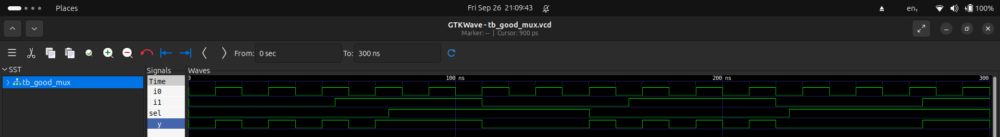

# Day 4 - GLS, Blocking vs Non-blocking and Synthesis-Simulation Mismatch

1. Running the test bench with Netlist as Design Under Test.
2. Netlist == RTL Code <logically same>
3. Same Testbench

### Why GLS?

1. Verify the logical correctness of design after synthesis.
2. Ensure the timing of the design is met.
		> For this GLS needs to be run with delay annotation.

### Synthesis Simulation Mismatch:

It happens because of the following reasons
1. Missing Sensitivity List
2. Blocking vs Non-Blocking assignment
3. Non Standard Verilog Coding

### Missing Sensitivity List:

> How does a Simulator work? -> looks for activity

### Blocking and Non-Blocking Statements:

>Inside always block
- '='  -> Blocking
	- Executes the statements in the order it is written.
	- So the first statement is evaluated before the second statement.

- '<=' -> Non-Blocking
	- Executes all the RHS when the always block is entered and assigns to LHS.
	- Parallel evaluation.

> Sequential circuit: use non-blocking statements.

> Ternary operator: ```<condn>?<True>:<False>```

### Commands:
- file_type: generated_netlist, verilog_models_file and the test_bench
- files: ternary_operator_mux.v, bad_mux.v, good_mux.v, blocking_caveat.v

### RTL SIMULATION:
```
iverilog <*_mux.v> <tb_*_mux.v>
./a.out
gtkwave <tb_*_mux.vcd>
```





### SYNTHESIS:
```
yosys
read_liberty -lib <lib_path>
read_verilog <*_mux.v>
synth -top <top_module_name>
abc -liberty <lib_path>
write_verilog -noattr <*_mux_noattr_generated_netlist.v>
show
```


### GLS:
```
iverilog /home/ank/.ciel/ciel/sky130/versions/a80ed405766c5d4f21c8bfca84552a7478fe75b2/sky130A/libs.ref/sky130_fd_sc_hd/verilog/primitives.v /home/ank/.ciel/ciel/sky130/versions/a80ed405766c5d4f21c8bfca84552a7478fe75b2/sky130A/libs.ref/sky130_fd_sc_hd/verilog/sky130_fd_sc_hd.v <*_mux.v> <tb_*_mux.v>
./a.out
gtkwave <tb_*_mux.vcd>
```


### [Verify Outputs](assets/)
### [Generated_Netlists](assets/FILES)
### [Lecture_Notes](assets/Lecture_Notes/)


