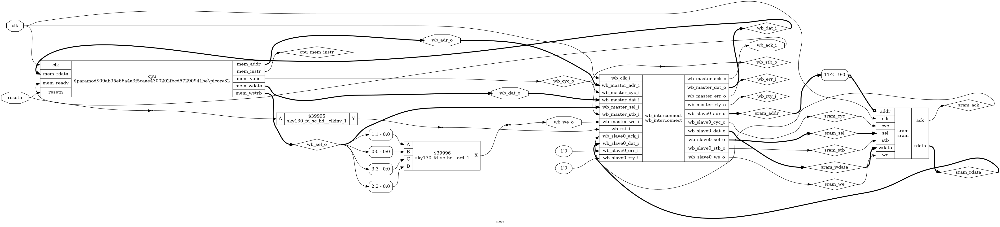
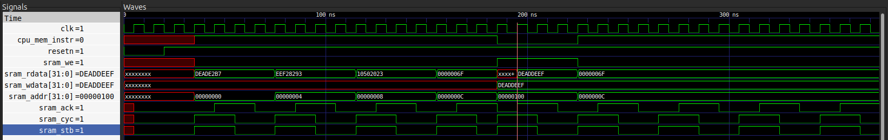
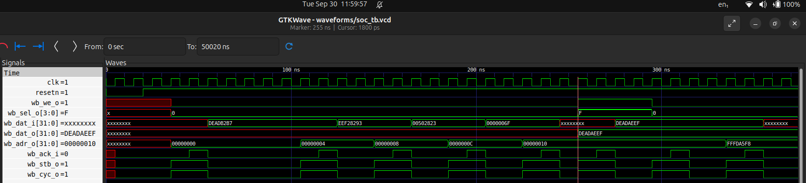
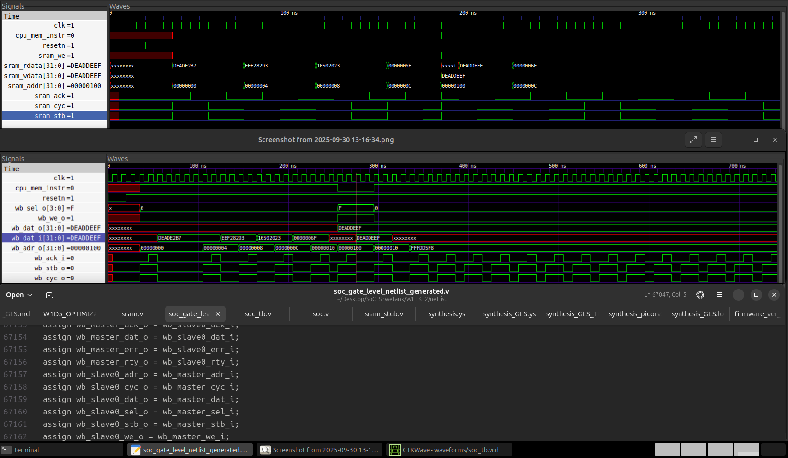
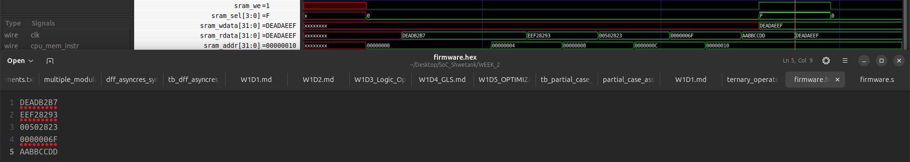
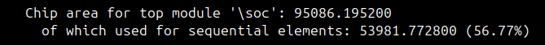
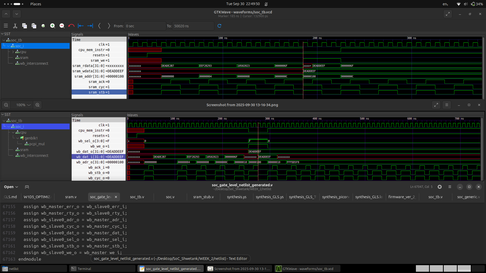

# Week 2: SoC Pre-Synthesis & Post-Synthesis Verification of BabySoC (Fundamentals & Functional Modelling)

This week documents the complete pre-synthesis and post-synthesis verification flow for a minimal RISC-V System-on-Chip (SoC). The primary objective was to ensure the functional correctness of the design at both the Register-Transfer Level (RTL) and the Gate-Level, culminating in a verified gate-level netlist ready for physical design.



## Part 1: SoC Fundamentals (Theory)

### Understanding System on a Chip (SoC)

A **System on a Chip (SoC)** is like a mini-computer built on a single chip. Instead of needing separate parts for each function, an SoC combines everything into one small package. This makes it especially useful for devices where space, power, and efficiency are important, like smartphones, smartwatches, and tablets.

#### Key Parts of an SoC

1. **CPU (Central Processing Unit)**: The brain of the SoC, handling all main instructions and decisions.
2. **Memory**: RAM for temporary data, ROM/Flash for permanent storage.
3. **I/O Ports**: Connect to external devices like cameras, USB.
4. **Graphics Processing Unit (GPU)**: Handles visuals and graphics.
5. **Digital Signal Processor (DSP)**: Processes audio and video signals.
6. **Power Management**: Regulates power usage for efficiency.
7. **Special Features**: Wi-Fi, Bluetooth, security modules.

#### Why SoCs Are Awesome

- **Space Saving**: Smaller devices.
- **Energy Efficient**: Lower power consumption.
- **High Performance**: Faster data processing.
- **Cost Effective**: Cheaper to manufacture.
- **Reliable**: Fewer failure points.

#### Where You’ll Find SoCs

- Smartphones, tablets, wearables, IoT devices, cars, TVs.

#### Some Popular SoCs

- Apple A-Series, Qualcomm Snapdragon, Samsung Exynos, NVIDIA Tegra.

#### Challenges with SoCs

- Complex design, heat issues, less flexibility.

### Types of SoCs

- **Microcontroller-based SoC**: For simple control tasks, low power.
- **Microprocessor-based SoC**: For demanding tasks, runs OS.
- **Application-Specific SoC**: For specific high-performance tasks.

## Part 2: Functional Modelling and Verification

## 1. Project Objective & SoC Architecture

The goal of this phase was to perform a comprehensive functional verification of a "BabySoC." The architecture consists of:
* **CPU Core:** `PicoRV32`, a 32-bit RISC-V processor.
* **Memory:** A 4KB behavioral model of a single-port SRAM.
* **Interconnect:** A Wishbone bus to connect the master (CPU) and slave (SRAM).

* **Also Check Out:** [VSDBabySoC](VSDBabySoC/README.md) for a simpler implementation to get started with.

### 1.1. Hands-on Functional Modelling Labs

The hands-on tasks involve installing simulation tools, compiling Verilog modules, simulating, and analyzing waveforms.

#### Tools Installation
- **Icarus Verilog (iverilog)**: Used for compiling Verilog code.
- **GTKWave**: Used for viewing simulation waveforms.

#### Steps Performed
1. **Compile the BabySoC Verilog modules using iverilog**:
   - Command: `iverilog -o simulation/soc_rtl.sim testbench/soc_tb.v src/soc.v src/wb_interconnect.v src/picorv32.v src/sram.v`
2. **Simulate and generate .vcd waveform files**:
   - Command: `./simulation/baby_soc_sim.sim`
3. **Open .vcd files in GTKWave and analyze**:
   - Command: `gtkwave waveforms/soc_tb.vcd`
   - Analysis of: Reset operation, Clocking, Dataflow between modules.

#### Simulation Logs
Simulation logs are available in `logs/synthesis.log` and other log files in the [/logs](/logs) directory.

#### GTKWave Screenshots and Explanations


*Figure: Pre-Synthesis Waveform showing RTL simulation. This waveform illustrates the reset operation where the system initializes, followed by clocking signals and dataflow between CPU, interconnect, and SRAM modules. The CPU fetches instructions sequentially, and the memory write operation confirms correct execution.*


*Figure: Post-Synthesis Waveform. After synthesis, the gate-level simulation shows identical behavior to RTL, verifying functional equivalence. Key events include instruction fetches, data writes, and loop execution.*


*Figure: Side-by-side comparison of RTL and GLS waveforms. The waveforms are functionally identical, confirming the synthesis preserved the design's logic.*

Additional screenshots: `assets/Firmware_data_loading.png`, `assets/Firmware_data_Post.png`, `assets/waveform_sram_1.png` provide further insights into firmware loading and SRAM interactions.
Check [/assets](assets/)


These labs demonstrate correct BabySoC behavior through simulation and waveform analysis.

---

## 2. RTL Functional Simulation

The first major goal was to verify the logical correctness of the RTL design.

### 2.1. Firmware Development
To perform a meaningful test, a simple firmware was written in RISC-V assembly. This program writes a known value (`0xDEADBEEF`) to a specific memory address (`0x100`) and then halts.

**Assembly (`firmware/firmware_ver_2.s`):**
```assembly
.section .text
.global _start

_start:
    li t0, 0xDEADBEEF      # Load Immediate value into t0
    sw t0, 256(x0)         # Store Word from t0 to address 0x100
loop:
    j loop                 # Infinite loop
```

This was compiled using the `riscv64-unknown-elf` toolchain finally into the following Verilog-compatible hex file.

#### RISC-V Firmware Compilation Flow

This document outlines the step-by-step process to compile a RISC-V assembly source file (`.s`) into a Verilog-compatible hexadecimal file (`.hex`) suitable for loading into a simulation model with `$readmemh`.

##### Prerequisites

Ensure the RISC-V GNU Toolchain is installed. For Ubuntu, this can be installed with:

```bash
sudo apt install gcc-riscv64-unknown-elf
```

##### Input Files

1.  **`firmware/firmware_ver_2.s`**: The assembly source code.
2.  **`firmware/link.ld`**: A linker script to place the code at the correct memory address (starting at `0x0`).

##### Compilation Steps

The process involves assembling, linking, extracting, and formatting the code.

###### 1\. Assemble (`.s` -\> `.o`)

This command assembles the source code into a machine-readable object file.

```bash
riscv64-unknown-elf-gcc -march=rv32im -mabi=ilp32 -c -o firmware_ver_2.o firmware_ver_2.s
```

  * **`-march=rv32im`**: Specifies the target **architecture** (32-bit RISC-V with Integer and Multiplication extensions).
  * **`-mabi=ilp32`**: Specifies the 32-bit **Application Binary Interface**.
  * **`-c`**: Compile or assemble only; do not link.

###### 2\. Link (`.o` -\> `.elf`)

This command links the object file into a final executable file, placing the code according to our script.

```bash
riscv64-unknown-elf-gcc -march=rv32im -mabi=ilp32 -T link.ld -nostartfiles -nostdlib -o firmware_ver_2.elf firmware_ver_2.o
```

  * **`-T link.ld`**: Uses the custom linker script.
  * **`-nostartfiles` / `-nostdlib`**: Prevents linking of standard C libraries and startup files for a bare-metal target.

###### 3\. Extract Binary (`.elf` -\> `.bin`)

This extracts the pure machine code from the executable file.

```bash
riscv64-unknown-elf-objcopy -O binary firmware_ver_2.elf firmware_ver_2.bin
```

  * **`-O binary`**: Sets the output format to raw binary.

###### 4\. Format to Hex (`.bin` -\> `.hex`)

This command reads the raw binary and formats it into clean, 32-bit hexadecimal words, with one word per line.

```bash
od -t x4 -An firmware_ver_2.bin | xargs -n 1 > firmware_ver_2_generated.hex
```

  * **`od -t x4 -An`**: Dumps the binary file as 4-byte hex words (`x4`) with no address offsets (`An`).
  * **`| xargs -n 1`**: Pipes the output and prints each space-separated word on a new line.

**Hex (`firmware/firmware_ver_2_generated.hex`):**
```
deade2b7
eef28293
00502823
0000006f
```

### 2.2. RTL Debugging
During initial simulations, several bugs were identified and fixed in the top-level `soc.v` RTL:
* **Undriven Signals:** The Wishbone signals `wb_cyc_o` and `wb_we_o` were not generated by the `PicoRV32` core. Glue logic was added to create them from other CPU signals.
* **Incorrect Port Connection:** An initial Verilog error was traced to an `output` port (`mem_instr`) of the CPU being incorrectly connected to a constant value. This was fixed by connecting it to a wire.
* **Swapped Data Bus:** A subtle bug was found where the read and write data buses between the SRAM and the interconnect were swapped, which was corrected.
* **SRAM Timing Mismatch:** The final RTL bug was a behavioral timing mismatch where the SRAM model had a registered read output, while the CPU expected a combinatorial read. The SRAM model was corrected to provide an instantaneous read path.

### 2.3. Final RTL Simulation
After fixing all RTL bugs, the `sram.v` model was modified to load the firmware using `$readmemh`. The simulation was run using Icarus Verilog.

**Command:**
```bash
# Compile RTL
iverilog -o simulation/soc_rtl.sim testbench/soc_tb.v src/soc.v src/wb_interconnect.v src/picorv32.v src/sram.v

# Run Simulation
./simulation/soc_rtl.sim

# Generate Waveform
gtkwave waveforms/soc_tb.vcd
```
The resulting waveform confirmed that the RTL design correctly fetches and executes the firmware program.


*(Pre-Synthesis Waveform: Shows correct RTL behavior with instruction fetches and memory writes.)*

---

## 3. Logic Synthesis

With a verified RTL, the next step was to synthesize the design into a gate-level netlist using **Yosys** and the **SkyWater 130nm** PDK.

### 3.1. Synthesis Strategy
**SRAM Black Boxing:** The behavioral SRAM is not synthesizable. It was treated as a black box by providing an empty stub module (`src/sram_stub.v`), with the assumption that a physical SRAM macro will be inserted during place and route.

### 3.2. Synthesis Script (`synthesis.ys`)
A robust script to handle the complex CPU core and prevent GLS initialization issues.
```tcl
# Yosys Synthesis Script:

# Read libraries and source files
read_liberty -lib <path/to/sky130.lib>
read_verilog src/wb_interconnect.v
read_verilog src/picorv32.v
read_verilog src/soc.v
read_verilog src/sram_stub.v

# Explicit Synthesis Flow
synth -top soc

# Technology Mapping
dfflibmap -liberty <path/to/sky130.lib>
abc -liberty <path/to/sky130.lib>

# Generate Outputs
write_verilog netlist/soc_gate_level_netlist_generated.v
stat -liberty <path/to/sky130.lib>
```

### 3.3. Synthesis Results
The synthesis completed successfully, producing a gate-level netlist (`soc_gate_level_netlist_generated.v`) and the following statistics:


* **Total Cell Count:** 7,570
* **Total Area:** ~95,086 µm²
* **Black Box Confirmation:** The report correctly listed `Area for cell type \sram is unknown!`.



```
10. Printing statistics.

=== $paramod$09ab95e66a4a3f5caae4300202fbcd57290941be\picorv32 ===

        +----------Local Count, excluding submodules.
        |        +-Local Area, excluding submodules.
        |        | 
    14653        - wires
    17210        - wire bits
      184        - public wires
     2292        - public wire bits
       27        - ports
      409        - port bits
     6660 8.33E+04 cells
        1   11.261   sky130_fd_sc_hd__a2111o_1
        4   35.034   sky130_fd_sc_hd__a2111oi_0
       12  105.101   sky130_fd_sc_hd__a211o_1
       51  382.867   sky130_fd_sc_hd__a211oi_1
        1    10.01   sky130_fd_sc_hd__a21bo_1
        7    52.55   sky130_fd_sc_hd__a21boi_0
       39  292.781   sky130_fd_sc_hd__a21o_1
      641 3.21E+03   sky130_fd_sc_hd__a21oi_1
        9   90.086   sky130_fd_sc_hd__a221o_1
       17  148.893   sky130_fd_sc_hd__a221oi_1
       41  410.394   sky130_fd_sc_hd__a222oi_1
       13  113.859   sky130_fd_sc_hd__a22o_1
       43   322.81   sky130_fd_sc_hd__a22oi_1
        6    52.55   sky130_fd_sc_hd__a2bb2oi_1
       13  130.125   sky130_fd_sc_hd__a311o_1
       16  140.134   sky130_fd_sc_hd__a311oi_1
        9   78.826   sky130_fd_sc_hd__a31o_1
       41  256.496   sky130_fd_sc_hd__a31oi_1
        4   40.038   sky130_fd_sc_hd__a32o_1
        8   70.067   sky130_fd_sc_hd__a32oi_1
        1    10.01   sky130_fd_sc_hd__a41o_1
        3   26.275   sky130_fd_sc_hd__a41oi_1
       80   500.48   sky130_fd_sc_hd__and2_0
       36  225.216   sky130_fd_sc_hd__and3_1
       10   87.584   sky130_fd_sc_hd__and4_1
      124  465.446   sky130_fd_sc_hd__clkinv_1
      349 6.99E+03   sky130_fd_sc_hd__dfxtp_1
     1313 3.94E+04   sky130_fd_sc_hd__edfxtp_1
       37  231.472   sky130_fd_sc_hd__lpflow_inputiso1p_1
       55   344.08   sky130_fd_sc_hd__lpflow_isobufsrc_1
       24   240.23   sky130_fd_sc_hd__maj3_1
       36  405.389   sky130_fd_sc_hd__mux2_1
      160  1.6E+03   sky130_fd_sc_hd__mux2i_1
      534  1.2E+04   sky130_fd_sc_hd__mux4_2
      657 2.47E+03   sky130_fd_sc_hd__nand2_1
       69  431.664   sky130_fd_sc_hd__nand2b_1
      104  520.499   sky130_fd_sc_hd__nand3_1
       11   82.579   sky130_fd_sc_hd__nand3b_1
       44  275.264   sky130_fd_sc_hd__nand4_1
        2   17.517   sky130_fd_sc_hd__nand4b_1
        1   11.261   sky130_fd_sc_hd__nand4bb_1
      638 2.39E+03   sky130_fd_sc_hd__nor2_1
       20   125.12   sky130_fd_sc_hd__nor2b_1
      104  520.499   sky130_fd_sc_hd__nor3_1
       13   97.594   sky130_fd_sc_hd__nor3b_1
       34  212.704   sky130_fd_sc_hd__nor4_1
        6    52.55   sky130_fd_sc_hd__nor4b_1
       10   87.584   sky130_fd_sc_hd__o2111ai_1
        2   20.019   sky130_fd_sc_hd__o211a_1
       41  307.795   sky130_fd_sc_hd__o211ai_1
       34  255.245   sky130_fd_sc_hd__o21a_1
      722 3.61E+03   sky130_fd_sc_hd__o21ai_0
        7    52.55   sky130_fd_sc_hd__o21bai_1
        3   33.782   sky130_fd_sc_hd__o221a_1
       42  367.853   sky130_fd_sc_hd__o221ai_1
        3   26.275   sky130_fd_sc_hd__o22a_1
       83  519.248   sky130_fd_sc_hd__o22ai_1
        3   26.275   sky130_fd_sc_hd__o2bb2ai_1
        2   20.019   sky130_fd_sc_hd__o311a_1
       14  122.618   sky130_fd_sc_hd__o311ai_0
        3   26.275   sky130_fd_sc_hd__o31a_1
       27  202.694   sky130_fd_sc_hd__o31ai_1
        4   40.038   sky130_fd_sc_hd__o32a_1
       14  122.618   sky130_fd_sc_hd__o32ai_1
        3   26.275   sky130_fd_sc_hd__o41ai_1
       18  112.608   sky130_fd_sc_hd__or3_1
        4   35.034   sky130_fd_sc_hd__or3b_1
        9   67.565   sky130_fd_sc_hd__or4_1
        1    10.01   sky130_fd_sc_hd__or4b_1
       93  814.531   sky130_fd_sc_hd__xnor2_1
       77  674.397   sky130_fd_sc_hd__xor2_1
        1        - submodules
        1        -   picorv32_pcpi_mul

   Chip area for module '$paramod$09ab95e66a4a3f5caae4300202fbcd57290941be\picorv32': 83323.664000
     of which used for sequential elements: 46414.515200 (55.70%)

=== picorv32_pcpi_mul ===

        +----------Local Count, excluding submodules.
        |        +-Local Area, excluding submodules.
        |        | 
     1635        - wires
     2389        - wire bits
       31        - public wires
      779        - public wire bits
       10        - ports
      134        - port bits
      907 1.18E+04 cells
       21  157.651   sky130_fd_sc_hd__a21o_1
       94  470.451   sky130_fd_sc_hd__a21oi_1
       15    93.84   sky130_fd_sc_hd__a31oi_1
       20   125.12   sky130_fd_sc_hd__and2_0
       17  106.352   sky130_fd_sc_hd__and3_1
       74  277.766   sky130_fd_sc_hd__clkinv_1
        9  180.173   sky130_fd_sc_hd__dfxtp_1
      246 7.39E+03   sky130_fd_sc_hd__edfxtp_1
        8   50.048   sky130_fd_sc_hd__lpflow_inputiso1p_1
        2   12.512   sky130_fd_sc_hd__lpflow_isobufsrc_1
       15  150.144   sky130_fd_sc_hd__maj3_1
       95 1.07E+03   sky130_fd_sc_hd__mux2_1
       34  127.622   sky130_fd_sc_hd__nand2_1
        1    6.256   sky130_fd_sc_hd__nand2b_1
       25   125.12   sky130_fd_sc_hd__nand3_1
        1    7.507   sky130_fd_sc_hd__nand3b_1
        2   12.512   sky130_fd_sc_hd__nand4_1
       37  138.883   sky130_fd_sc_hd__nor2_1
        2   12.512   sky130_fd_sc_hd__nor2b_1
        5   25.024   sky130_fd_sc_hd__nor3_1
        2   15.014   sky130_fd_sc_hd__nor3b_1
        4   25.024   sky130_fd_sc_hd__nor4_1
        2   17.517   sky130_fd_sc_hd__nor4b_1
        1    7.507   sky130_fd_sc_hd__o211ai_1
       44  330.317   sky130_fd_sc_hd__o21a_1
       79  395.379   sky130_fd_sc_hd__o21ai_0
        1    10.01   sky130_fd_sc_hd__o21ba_1
       26  195.187   sky130_fd_sc_hd__o21bai_1
        8   70.067   sky130_fd_sc_hd__xnor2_1
       17  148.893   sky130_fd_sc_hd__xor2_1

   Chip area for module '\picorv32_pcpi_mul': 11751.270400
     of which used for sequential elements: 7567.257600 (64.40%)

=== soc ===

        +----------Local Count, excluding submodules.
        |        +-Local Area, excluding submodules.
        |        | 
       31        - wires
      223        - wire bits
       21        - public wires
      213        - public wire bits
        7        - ports
       69        - port bits
        3   11.261 cells
        1    3.754   sky130_fd_sc_hd__clkinv_1
        1    7.507   sky130_fd_sc_hd__or4_1
        1        -   sram
        2        - submodules
        1        -   $paramod$09ab95e66a4a3f5caae4300202fbcd57290941be\picorv32
        1        -   wb_interconnect

   Area for cell type \sram is unknown!

   Chip area for module '\soc': 11.260800
     of which used for sequential elements: 0.000000 (0.00%)

=== wb_interconnect ===

        +----------Local Count, excluding submodules.
        |        +-Local Area, excluding submodules.
        |        | 
       22        - wires
      214        - wire bits
       22        - public wires
      214        - public wire bits
       22        - ports
      214        - port bits

=== design hierarchy ===

        +----------Count including submodules.
        |        +-Area including submodules.
        |        | 
     7570 9.51E+04 soc
     6660 8.33E+04 $paramod$09ab95e66a4a3f5caae4300202fbcd57290941be\picorv32
      907 1.18E+04   picorv32_pcpi_mul

        +----------Count including submodules.
        |        +-Area including submodules.
        |        | 
    16341        - wires
    20036        - wire bits
      258        - public wires
     3498        - public wire bits
       66        - ports
      826        - port bits
        -        - memories
        -        - memory bits
        -        - processes
     7570 9.51E+04 cells
        1   11.261   sky130_fd_sc_hd__a2111o_1
        4   35.034   sky130_fd_sc_hd__a2111oi_0
       12  105.101   sky130_fd_sc_hd__a211o_1
       51  382.867   sky130_fd_sc_hd__a211oi_1
        1    10.01   sky130_fd_sc_hd__a21bo_1
        7    52.55   sky130_fd_sc_hd__a21boi_0
       60  450.432   sky130_fd_sc_hd__a21o_1
      735 3.68E+03   sky130_fd_sc_hd__a21oi_1
        9   90.086   sky130_fd_sc_hd__a221o_1
       17  148.893   sky130_fd_sc_hd__a221oi_1
       41  410.394   sky130_fd_sc_hd__a222oi_1
       13  113.859   sky130_fd_sc_hd__a22o_1
       43   322.81   sky130_fd_sc_hd__a22oi_1
        6    52.55   sky130_fd_sc_hd__a2bb2oi_1
       13  130.125   sky130_fd_sc_hd__a311o_1
       16  140.134   sky130_fd_sc_hd__a311oi_1
        9   78.826   sky130_fd_sc_hd__a31o_1
       56  350.336   sky130_fd_sc_hd__a31oi_1
        4   40.038   sky130_fd_sc_hd__a32o_1
        8   70.067   sky130_fd_sc_hd__a32oi_1
        1    10.01   sky130_fd_sc_hd__a41o_1
        3   26.275   sky130_fd_sc_hd__a41oi_1
      100    625.6   sky130_fd_sc_hd__and2_0
       53  331.568   sky130_fd_sc_hd__and3_1
       10   87.584   sky130_fd_sc_hd__and4_1
      199  746.966   sky130_fd_sc_hd__clkinv_1
      358 7.17E+03   sky130_fd_sc_hd__dfxtp_1
     1559 4.68E+04   sky130_fd_sc_hd__edfxtp_1
       45   281.52   sky130_fd_sc_hd__lpflow_inputiso1p_1
       57  356.592   sky130_fd_sc_hd__lpflow_isobufsrc_1
       39  390.374   sky130_fd_sc_hd__maj3_1
      131 1.48E+03   sky130_fd_sc_hd__mux2_1
      160  1.6E+03   sky130_fd_sc_hd__mux2i_1
      534  1.2E+04   sky130_fd_sc_hd__mux4_2
      691 2.59E+03   sky130_fd_sc_hd__nand2_1
       70   437.92   sky130_fd_sc_hd__nand2b_1
      129  645.619   sky130_fd_sc_hd__nand3_1
       12   90.086   sky130_fd_sc_hd__nand3b_1
       46  287.776   sky130_fd_sc_hd__nand4_1
        2   17.517   sky130_fd_sc_hd__nand4b_1
        1   11.261   sky130_fd_sc_hd__nand4bb_1
      675  2533.68   sky130_fd_sc_hd__nor2_1
       22  137.632   sky130_fd_sc_hd__nor2b_1
      109  545.523   sky130_fd_sc_hd__nor3_1
       15  112.608   sky130_fd_sc_hd__nor3b_1
       38  237.728   sky130_fd_sc_hd__nor4_1
        8   70.067   sky130_fd_sc_hd__nor4b_1
       10   87.584   sky130_fd_sc_hd__o2111ai_1
        2   20.019   sky130_fd_sc_hd__o211a_1
       42  315.302   sky130_fd_sc_hd__o211ai_1
       78  585.562   sky130_fd_sc_hd__o21a_1
      801 4.01E+03   sky130_fd_sc_hd__o21ai_0
        1    10.01   sky130_fd_sc_hd__o21ba_1
       33  247.738   sky130_fd_sc_hd__o21bai_1
        3   33.782   sky130_fd_sc_hd__o221a_1
       42  367.853   sky130_fd_sc_hd__o221ai_1
        3   26.275   sky130_fd_sc_hd__o22a_1
       83  519.248   sky130_fd_sc_hd__o22ai_1
        3   26.275   sky130_fd_sc_hd__o2bb2ai_1
        2   20.019   sky130_fd_sc_hd__o311a_1
       14  122.618   sky130_fd_sc_hd__o311ai_0
        3   26.275   sky130_fd_sc_hd__o31a_1
       27  202.694   sky130_fd_sc_hd__o31ai_1
        4   40.038   sky130_fd_sc_hd__o32a_1
       14  122.618   sky130_fd_sc_hd__o32ai_1
        3   26.275   sky130_fd_sc_hd__o41ai_1
       18  112.608   sky130_fd_sc_hd__or3_1
        4   35.034   sky130_fd_sc_hd__or3b_1
       10   75.072   sky130_fd_sc_hd__or4_1
        1    10.01   sky130_fd_sc_hd__or4b_1
      101  884.598   sky130_fd_sc_hd__xnor2_1
       94   823.29   sky130_fd_sc_hd__xor2_1
        1        -   sram
        2 9.51E+04 submodules
        1 9.51E+04   $paramod$09ab95e66a4a3f5caae4300202fbcd57290941be\picorv32
        1        -   wb_interconnect

   Area for cell type \sram is unknown!

   Chip area for top module '\soc': 95086.195200
     of which used for sequential elements: 53981.772800 (56.77%)

```
[Check](logs/synthesis.log): the full synthesis report for more details.


*(Synthesis Statistics: Shows cell count, area, and black box confirmation.)*

---

## 4. Post-Synthesis Verification (Gate-Level Simulation)

The final step is to verify that the generated netlist is functionally equivalent to the original RTL.
This is done through Gate-Level Simulation (GLS).

### 4.1. Analysis of the Post-Synthesis Simulation Waveform

The following is a detailed, step-by-step analysis of the Gate-Level Simulation (GLS) waveform. This waveform provides definitive proof that the synthesized gate-level netlist is functionally identical to the original RTL and correctly executes the firmware program from power-on reset.

#### 4.1.1. Post-Reset State
The waveform begins after the initial reset period. The `resetn` signal is held high (`1`), indicating that the SoC is out of its reset state and is actively running. The `clk` signal is oscillating, providing the heartbeat for the system.

#### 4.1.2. Sequential Instruction Fetches
The CPU's first action is to fetch its program instructions sequentially from memory, starting at the reset address (`0x0`).

* **First Fetch:** The first transaction is a **READ** (`wb_we_o` is `0`) from address `0x00000000`. The data returned on `wb_dat_i` is **`0xdeade2b7`**, which perfectly matches the first instruction in our firmware.
* **Second Fetch:** The CPU then fetches from the next address, `0x00000004`, and correctly reads the second instruction, **`0xeef28293`**.
* **Third Fetch:** The CPU proceeds to address `0x00000008` and reads the third instruction, **`0x00502823`**.

This sequence confirms the Program Counter is incrementing correctly and the CPU is successfully fetching the program from the simulated SRAM.


#### 4.1.3. The Memory Write Execution
This is the most critical event in the simulation, proving the CPU is not just fetching but also *executing* the program. After fetching the first few instructions, the CPU executes the `sw` (Store Word) instruction.

* **Request:** A **WRITE** transaction is initiated, indicated by the `wb_we_o` (write enable) signal going high (`1`).
* **Address:** The CPU places the target memory address on the bus: `wb_adr_o` shows **`0x00000100`**.
* **Data:** The CPU places the data it prepared in its register on the bus: `wb_dat_o` shows **`0xdeadbeef`**.
* **Acknowledge:** The memory system performs the write and responds by pulsing the `wb_ack_i` signal, completing the handshake.

This proves that the CPU correctly fetched, decoded, and executed the `li` and `sw` instructions, manipulating data and writing to memory as intended by the software.

#### 4.1.4. Control Flow and Halting (Infinite Loop)
The final stage of the program is to halt the processor.

* **Fetch Jump:** After the write operation, the CPU fetches the next instruction from address `0x0000000c`. The data returned is **`0x0000006f`**, which is the machine code for the `j loop` instruction.
* **Looping:** The waveform shows that all subsequent fetch requests from the CPU are also to the same address, `0x0000000c`.


This demonstrates that the control flow instruction (`j`) was executed correctly, causing the Program Counter to repeatedly jump back to the same location and effectively halting the processor in a tight loop.

#### 4.1.5. Conclusion
This waveform provides a complete and unambiguous validation of the synthesized design. It confirms the successful execution of the entire firmware program on the gate-level netlist, proving that the logic is sound and functionally equivalent to the pre-synthesis RTL. The design is now verified and ready for the physical design stages.

### 4.2. GLS Flow

**Synthesis Script (`synthesis.ys`):**
```tcl
read_liberty -lib /home/ank/.ciel/ciel/sky130/versions/a80ed405766c5d4f21c8bfca84552a7478fe75b2/sky130A/libs.ref/sky130_fd_sc_hd/lib/sky130_fd_sc_hd__tt_025C_1v80.lib
read_verilog src/wb_interconnect.v
read_verilog src/picorv32.v
read_verilog src/soc.v
read_verilog src/sram.v
synth -top soc
dfflibmap -liberty /home/ank/.ciel/ciel/sky130/versions/a80ed405766c5d4f21c8bfca84552a7478fe75b2/sky130A/libs.ref/sky130_fd_sc_hd/lib/sky130_fd_sc_hd__tt_025C_1v80.lib
abc -liberty /home/ank/.ciel/ciel/sky130/versions/a80ed405766c5d4f21c8bfca84552a7478fe75b2/sky130A/libs.ref/sky130_fd_sc_hd/lib/sky130_fd_sc_hd__tt_025C_1v80.lib
write_verilog netlist/soc_gate_level_netlist_generated.v
stat -liberty /home/ank/.ciel/ciel/sky130/versions/a80ed405766c5d4f21c8bfca84552a7478fe75b2/sky130A/libs.ref/sky130_fd_sc_hd/lib/sky130_fd_sc_hd__tt_025C_1v80.lib
show soc
```

**GLS Compile Command:**
```bash
iverilog path/to/sky130_fd_sc_hd/verilog/primitives.v path/to/sky130_fd_sc_hd/verilog/sky130_fd_sc_hd.v path/to/src/sram.v path/to/soc_gate_level_netlist_generated.v path/to/testbench/soc_tb.v
./simulation/soc_gls.sim
gtkwave waveforms/soc_tb.vcd
```

### 4.3. Final Verification Result
The GLS ran successfully. The resulting waveform was compared side-by-side with the original RTL simulation waveform, and they were found to be **functionally identical**, as shown below.


*(Side-by-side comparison confirming functional equivalence between RTL and Gate-Level simulations.)*

## 5. Conclusion

The pre-synthesis and post-synthesis verification for the BabySoC is complete and successful. The logical correctness of the design has been proven at both the RTL and gate levels. This has produced a verified gate-level netlist.
