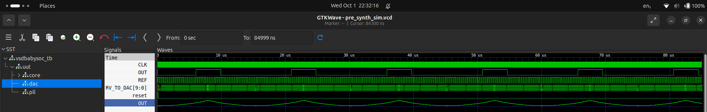
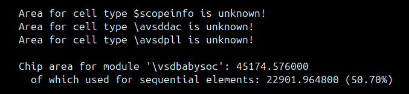
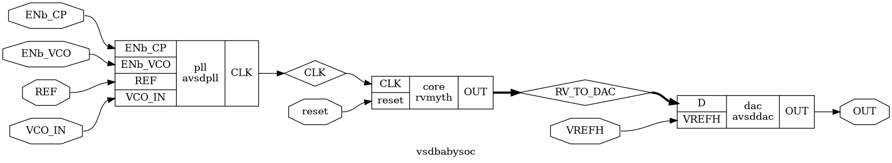

|# VSD BabySoC: RTL to Post-Synthesis Verification

This document provides a comprehensive walkthrough of the synthesis and post-synthesis verification flow for the `vsdbabysoc` System-on-Chip. The project integrates the `rvmyth` RISC-V core with two analog IPs, `avsddac` (a DAC) and `avsdpll` (a PLL), using an open-source toolchain featuring Yosys for synthesis and Icarus Verilog for simulation.

The primary goal is to convert the high-level RTL design into a gate-level netlist based on the SkyWater 130nm technology library and to verify that the resulting netlist is functionally equivalent to the original design.

## Table of Contents

0.  [Pre-Synthesis Verification (RTL)](#0-pre-synthesis-verification-rtl)
1.  [Synthesis Flow Overview](#1-synthesis-flow-overviewSynthesis-Flow-Overview)
2.  [Key Concept: Black-Boxing Analog IPs](#2-key-concept-black-boxing-analog-ips)
3.  [The Synthesis Script](#3-the-synthesis-script)
4.  [The Debugging Journey: Errors & Resolutions](#4-the-debugging-journey-errors--resolutions)
      * [Error 1: Missing Include File](#error-1-missing-include-file)
      * [Error 2: Architectural & Port Mismatches](#error-2-architectural--port-mismatches)
5.  [Executing Synthesis](#5-executing-synthesis)
6.  [Synthesis Results](#6-synthesis-results)
7.  [Post-Synthesis Verification (GLS)](#7-post-synthesis-verification-gls)
8.  [Conclusion](#8-conclusion)

## Pre-requisites:

- Install Yosys, Icarus Verilog, and GTKWave. Refer to their respective documentation for installation instructions in WEEK_0.
- Install Sandpiper for Verilog generation from TL-Verilog: rvmyth is in TL-Verilog.

  - **Command**:

    ```bash
    pip3 install pyyaml click sandpiper-saas
    sandpiper-saas -i ./src/module/*.tlv -o rvmyth.v --bestsv --noline -p verilog --outdir ./src/module/
    ```

  - **Note**: The `rvmyth.v` file is generated from `rvmyth.tlv` using Sandpiper. This file is included in the synthesis and simulation processes.

  - **Files**:
    ```bash
    path/to/VSDBabySoC$ tree -a
    .
    ├── assets
    │   ├── chip_stats.png
    │   ├── comp_pre_vs_post_synth_sim_2.png
    │   ├── comp_pre_vs_post_synth_sim.png
    │   ├── vsdbabysoc.yosys_show.png
    │   ├── waveform_post_synth_sim.png
    │   ├── waveform_pre_synth_sim_2.png
    │   └── waveform_pre_synth_sim.png
    ├── reports
    │   ├── logs
    │   │   └── synthesis_yosis.log
    │   └── vsdbabysoc_netlist.v
    ├── simulation
    │   ├── dump.vcd
    │   ├── post_synth_sim.out
    │   ├── pre_synth_sim.out
    │   └── pre_synth_sim.vcd
    └── src
        ├── gds
        │   ├── avsddac.gds
        │   └── avsdpll.gds
        ├── gls_model
        │   ├── primitives.v
        │   └── sky130_fd_sc_hd.v
        ├── include
        │   ├── sandpiper_gen.vh
        │   ├── sandpiper.vh
        │   ├── sp_default.vh
        │   └── sp_verilog.vh
        ├── layout_conf
        │   ├── rvmyth
        │   │   ├── config.tcl
        │   │   └── pin_order.cfg
        │   └── vsdbabysoc
        │       ├── config.tcl
        │       ├── macro.cfg
        │       └── pin_order.cfg
        ├── lef
        │   ├── avsddac.lef
        │   └── avsdpll.lef
        ├── lib
        │   ├── avsddac.lib
        │   ├── avsdpll.lib
        │   └── sky130_fd_sc_hd__tt_025C_1v80.lib
        ├── module
        │   ├── avsddac_stub.v
        │   ├── avsddac.v
        │   ├── avsdpll_stub.v
        │   ├── avsdpll.v
        │   ├── clk_gate.v
        │   ├── pseudo_rand_gen.sv
        │   ├── pseudo_rand.sv
        │   ├── rvmyth_gen.v
        │   ├── rvmyth.tlv
        │   ├── rvmyth.v
        │   ├── testbench.rvmyth.post-routing.v
        │   ├── testbench.v
        │   └── vsdbabysoc.v
        ├── script
        │   ├── sta.conf
        │   ├── verilog_to_lib.pl
        │   ├── yosys_wo_lc_shell.ys
        │   └── yosys.ys
        └── sdc
            ├── vsdbabysoc_layout.sdc
            └── vsdbabysoc_synthesis.sdc
    ``` 

## 0\. Pre-Synthesis Verification (RTL)

Before synthesis, the RTL design was verified using a testbench (`testbench.v`) that instantiates the `vsdbabysoc` module and applies a series of stimulus to validate its functionality. The simulation was run using Icarus Verilog, and the waveform was inspected in GTKWave to ensure correct operation.

  - **Command**:

    ```bash
    iverilog -o simulation/pre_synth_sim.out -DPRE_SYNTH_SIM src/module/testbench.v -I src/include -I src/module
    ```

  - **Execution**:

    ```bash
    cd simulation
    ./pre_synth_sim.out
    gtkwave pre_synth_sim.vcd
    ```

  - **Results**: The RTL simulation waveform confirmed that the CPU could successfully write to the DAC and that the PLL locked correctly, indicating that the design was functionally sound before synthesis.

  


## 1\. Synthesis Flow Overview

The synthesis process converts the abstract RTL (Verilog) code into a physical implementation composed of standard logic gates from a specific technology library (PDK).

  - **Inputs**:
      - RTL Verilog files (`vsdbabysoc.v`, `rvmyth.v`)
      - Analog IP stubs (`avsddac_stub.v`, `avsdpll_stub.v`)
      - Technology timing libraries (`.lib` files)
  - **Tool**: `Yosys` Open SYnthesis Suite
  - **Output**: A gate-level netlist (`vsdbabysoc_netlist.v`)

## 2\. Key Concept: Black-Boxing Analog IPs

A critical step in a mixed-signal SoC flow is handling the analog macros (`avsddac`, `avsdpll`). The synthesis tool cannot create these blocks from digital gates. Therefore, we treat them as **"black boxes"**.

  - **For Simulation**: We use the full behavioral Verilog models to verify functionality.
  - **For Synthesis**: We provide **stub files**. These are empty Verilog modules that only declare the module's name and its input/output ports. This tells Yosys what the IP's interface looks like without trying to synthesize its internal (and non-synthesizable) logic.

#### `src/module/avsddac_stub.v`

```verilog
// Stub module for the avsddac analog IP.
// This is a black box for synthesis. Do not add logic here.

module avsddac (
   output OUT,
   input [9:0] D,
   input VREFH,
   input VREFL
);

// Intentionally empty

endmodule
```

#### `src/module/avsdpll_stub.v`

```verilog
// Stub module for the avsdpll analog IP.
// This is a black box for synthesis. Do not add logic here.

module avsdpll (
   output reg  CLK,
   input  wire VCO_IN,
   input  wire ENb_CP,
   input  wire ENb_VCO,
   input  wire REF
);

// Intentionally empty

endmodule
```

## 3\. The Synthesis Script

We use a Yosys script (`src/script/yosys_wo_lc_shell.ys`) to automate the synthesis process. This script reads the libraries and RTL, runs the synthesis and mapping commands, and writes the final netlist.

#### Final `src/script/yosys_wo_lc_shell.ys` Script

```tcl
read_liberty -lib src/lib/sky130_fd_sc_hd__tt_025C_1v80.lib
read_liberty -lib src/lib/avsddac.lib
read_liberty -lib src/lib/avsdpll.lib
read_verilog src/module/vsdbabysoc.v
read_verilog -I src/include src/module/rvmyth.v
read_verilog -I src/include src/module/clk_gate.v
read_verilog src/module/avsddac_stub.v
read_verilog src/module/avsdpll_stub.v
synth -top vsdbabysoc
dfflibmap -liberty src/lib/sky130_fd_sc_hd__tt_025C_1v80.lib
opt
abc -liberty src/lib/sky130_fd_sc_hd__tt_025C_1v80.lib
flatten
setundef -zero
clean -purge
rename -enumerate
write_verilog -noattr reports/vsdbabysoc_netlist.v
stat -liberty src/lib/sky130_fd_sc_hd__tt_025C_1v80.lib
show vsdbabysoc
```

## 4\. The Debugging Journey: Errors & Resolutions

The path to a successful synthesis involved solving several key issues.

### Error 1: Missing Include File

  - **Symptom**: Yosys failed during RTL parsing with the error:
    ```
    ERROR: Can't open include file 'sp_verilog.vh /*_\SV */'!
    ```
  - **Root Cause**: The `rvmyth` core uses `include` directives to import Verilog header files (`.vh`). Yosys was not aware of the `src/include/` directory where these files are located.
  - **Resolution**: Add the `-I src/include` flag to required `read_verilog` commands in the Yosys script. This tells Yosys to add that directory to its search path for header files.

### Error 2: Architectural & Port Mismatches

  - **Symptom**: After fixing the include path, synthesis failed during the hierarchy check with port mismatch errors, such as:
    ```
    ERROR: Module 'avsddac' ... does not have a port named 'VREFH'.
    ```
  - **Root Cause**: The initial version of `avsddac_stub.v` and `avsdpll_stub.v` had fundamental architectural flaws. The instantiations of, `avsddac`, and `avsdpll` were using entirely incorrect port names and connections that did not match the actual module definitions. For example, `avsddac` was instantiated with ports that did not exist in its definition.This was due to use of placeholder names and stub modules for the analog IPs.
  - **Resolution**: The corrected version instantiates all IPs with their proper port names and adds the necessary glue logic for the CPU to control the DAC via a simple memory-mapped scheme. This aligned the top-level design with the actual IP interfaces.

## 5\. Executing Synthesis

With the corrected `*_stub.v` and the final Yosys script, synthesis is run with a single command from the project root:

```bash
yosys src/script/yosys_wo_lc_shell.ys | tee synthesis_yosis.log
```

The full execution log can be found in `reports/logs/synthesis_yosis.log`.

## 6\. Synthesis Results

The synthesis successfully completed, producing the gate-level netlist `reports/vsdbabysoc_netlist.v`. The final statistics report the cell count and estimated area.




## 7\. Post-Synthesis Verification (GLS)

To ensure the synthesis process did not alter the design's logic, we perform a **Gate-Level Simulation (GLS)**. This involves simulating the generated netlist with the same testbench used for the original RTL.

  - **Command**: The `iverilog` command for GLS is more complex, as it requires the Verilog models for the Sky130 standard cells.

    ```bash
     iverilog -DFUNCTIONAL -DUNIT_DELAY=#1 -o simulation/post_synth_sim.out src/gls_model/primitives.v src/gls_model/sky130_fd_sc_hd.v reports/vsdbabysoc_netlist.v src/module/avsdpll.v src/module/avsddac.v src/module/testbench.v
    ```

  - **Execution**:

    ```bash
    cd simulation
    ./post_synth_sim.out
    gtkwave dump.vcd
    ```

  - **Results**: The GLS waveform was compared against the pre-synthesis (RTL) waveform. They were found to be identical, confirming that the synthesized netlist is functionally correct.

  

## 8\. Conclusion

This process successfully transformed the `vsdbabysoc` RTL design into a verified, synthesizable gate-level netlist. The debugging journey highlighted the importance of correctly handling IP integration, from Verilog header paths to precise port-matching in hierarchical designs. The identical pre- and post-synthesis simulation results provide high confidence in the netlist, which is now ready for the Physical Design (Place and Route) stage.