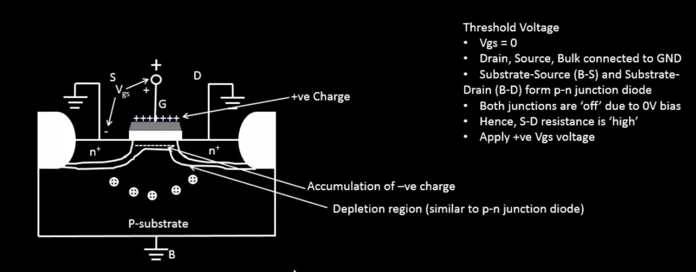
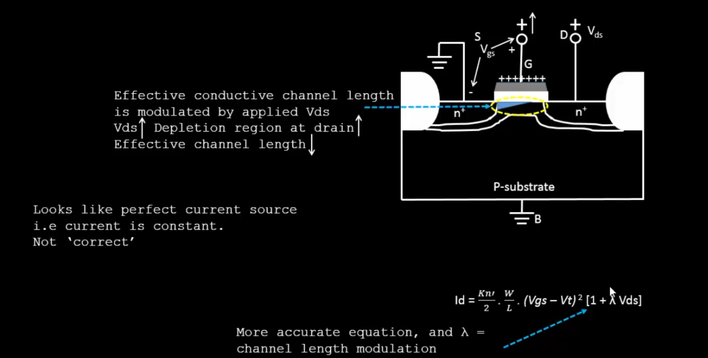
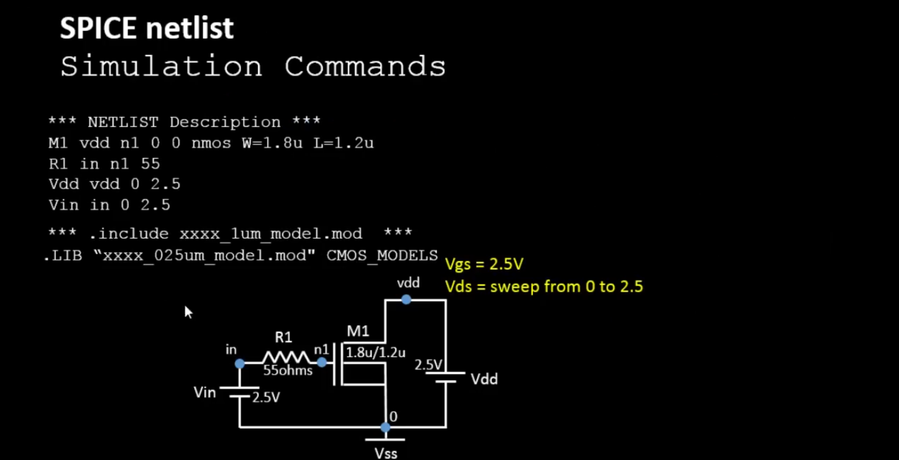
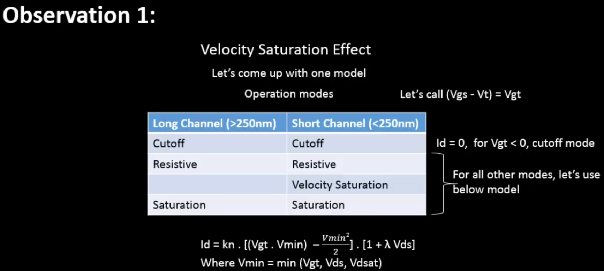
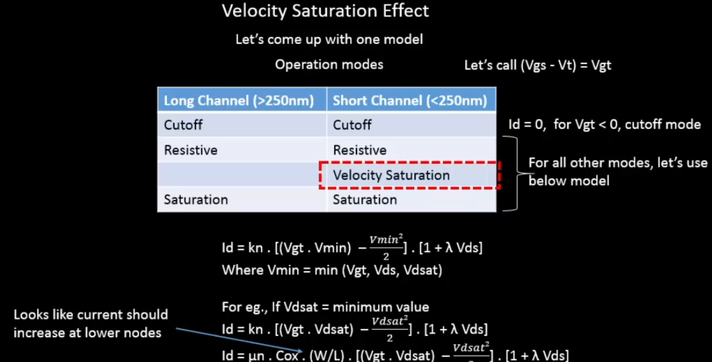
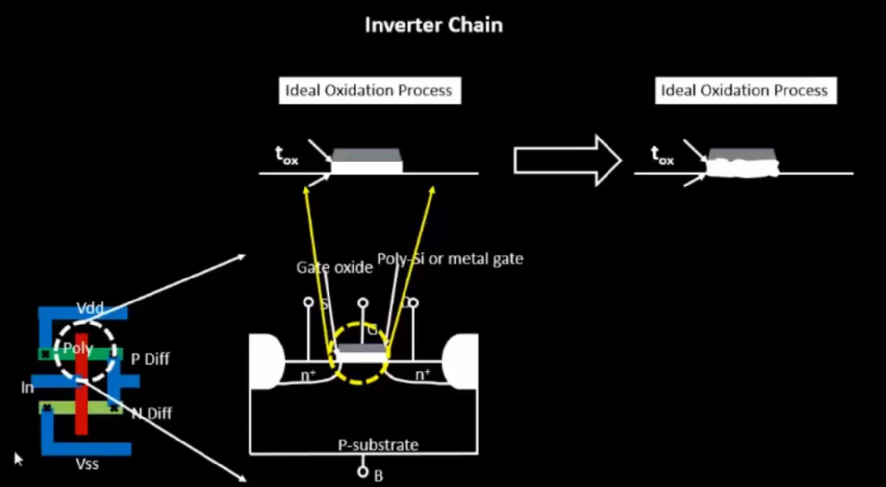

# Week 4: CMOS Inverter Static Behavior Evaluation and SPICE Simulations

## Table of Contents
- [Overview](#overview)
- [Introduction to Circuit Design and SPICE Simulations](#introduction-to-circuit-design-and-spice-simulations)
  - [Theory: Why SPICE Simulations?](#theory-why-spice-simulations)
  - [SPICE Simulation Overview](#spice-simulation-overview)
  - [Introduction to Basic Element: NMOS Transistor](#introduction-to-basic-element-nmos-transistor)
  - [NMOS Resistive and Saturation Regions](#nmos-resistive-and-saturation-regions)
  - [SPICE Netlist Example](#spice-netlist-example)
  - [Labs: Introduction to SPICE](#labs-introduction-to-spice)
    - [Outputs](#outputs)
- [SPICE Simulation for Lower Nodes and Velocity Saturation Effect](#spice-simulation-for-lower-nodes-and-velocity-saturation-effect)
  - [Theory: SPICE for Lower Nodes](#theory-spice-for-lower-nodes)
  - [CMOS Voltage Transfer Characteristics (VTC)](#cmos-voltage-transfer-characteristics-vtc)
  - [Labs: SPICE for Lower Nodes and Velocity Saturation](#labs-spice-for-lower-nodes-and-velocity-saturation)
    - [Example 1 Outputs](#example-1-outputs)
    - [Example 2 Output](#example-2-output)
- [Voltage Transfer Characteristics: SPICE Simulations](#voltage-transfer-characteristics-spice-simulations)
  - [Theory: CMOS Inverter SPICE Netlist](#theory-cmos-inverter-spice-netlist)
  - [SPICE simulation for CMOS inverter](#spice-simulation-for-cmos-inverter)
  - [Static Behavior Evaluation: CMOS Inverter Robustness and Switching Threshold (Vm)](#static-behavior-evaluation-cmos-inverter-robustness-and-switching-threshold-vm)
  - [Velocity Saturation and Switching Threshold (Vm) Analysis](#velocity-saturation-and-switching-threshold-vm-analysis)
  - [Labs: VTC SPICE Simulations](#labs-vtc-spice-simulations)
    - [VTC Plot](#vtc-plot)
    - [Transient Plot](#transient-plot)
    - [Fall Delay](#fall-delay)
    - [Rise Delay](#rise-delay)
- [Static Behavior Evaluation: CMOS Inverter Robustness and Noise Margin](#static-behavior-evaluation-cmos-inverter-robustness-and-noise-margin)
  - [Theory: Noise Margin](#theory-noise-margin)
  - [Labs: Noise Margin - Sky130 Inverter (Wp/Lp=1u/0.15u, Wn/Ln=0.36u/0.15u)](#labs-noise-margin---sky130-inverter-wplp1u015u-wnln036u015u)
    - [Noise Margin High](#noise-margin-high)
    - [Noise Margin Low](#noise-margin-low)
- [Static Behavior Evaluation: CMOS Inverter Robustness - Power Supply Variation](#static-behavior-evaluation-cmos-inverter-robustness---power-supply-variation)
  - [Theory: Power Supply Variation](#theory-power-supply-variation)
  - [Oxide Thickness Variations](#oxide-thickness-variations)
  - [CMOS Inverter Robustness to Extreme Device Width Variation](#cmos-inverter-robustness-to-extreme-device-width-variation)
  - [Labs: Power Supply Variation](#labs-power-supply-variation)
    - [Smart SPICE for Power Supply Variations](#smart-spice-for-power-supply-variations)
    - [Extreme Device Width Variation](#extreme-device-width-variation)
    - [Gain Plots](#gain-plots)
- [SPICE Netlists and Code](#spice-netlists-and-code)
- [Tabulated Results](#tabulated-results)
- [Observations / Analysis](#observations--analysis)
- [Conclusions](#conclusions)
- [References / Citations](#references--citations)

## Overview
Week 4 explores the fundamentals of circuit design, SPICE simulations, and the static characteristics of CMOS inverters. Topics include transistor operation, voltage transfer characteristics (VTC), noise margins, switching thresholds, and robustness to process and supply variations. Labs demonstrate practical SPICE simulations using Sky130 models, with outputs visualized through plots and waveforms.

Key themes:
- Introduction to SPICE and NMOS transistor basics.
- Velocity saturation effects in lower technology nodes.
- CMOS inverter VTC and transient analysis.
- Noise margin calculations and robustness.
- Impact of power supply and device variations on inverter performance.

## Introduction to Circuit Design and SPICE Simulations

### Theory: Why SPICE Simulations?
SPICE (Simulation Program with Integrated Circuit Emphasis) verifies circuit behavior and performance before implementation. In circuit design, logic gates like NAND, NOR, and NOT are built using NMOS and PMOS transistors. For an inverter:
- PMOS (pull-up) and NMOS (pull-down) drains connect to the output with a capacitive load.
- Both gates connect to the input, PMOS source to VDD, NMOS source to GND.

SPICE ensures circuits meet functionality, timing, and power requirements.

### SPICE Simulation Overview
SPICE allows virtual testing of circuits. Input waveforms generate output waveforms, enabling measurement of parameters like **delay**. Design parameters such as transistor **width (W)** and **length (L)** control current flow and delay for optimization.


For buffers (e.g., CBUF1 vs. CBUF2), differences arise from drive strengths or W/L ratios. Delay tables are derived from SPICE simulations.


### Introduction to Basic Element: NMOS Transistor
An NMOS transistor conducts when a positive voltage is applied to the gate, enabling current flow from drain to source.


**Threshold Voltage (Vt)**: Voltage at which the transistor switches from off to on, key for SPICE simulations.

**Strong Inversion**: Full channel formation for significant current flow.

**Threshold Voltage with Substrate Potential**: Vt varies with substrate potential due to the body effect.




At Vsb = 0, Vt is the baseline. Body effect coefficient and Fermi potential are foundry-provided constants for SPICE models.

### NMOS Resistive and Saturation Regions
- **Resistive Region**: Small Vds, current increases linearly with Vds.
- **Saturation Region**: Vds ≥ Vgs - Vt, Id independent of Vds.


Drain current models:
- Linear: Id = μn Cox (W/L) [(Vgs - Vt)Vds - (Vds²/2)]
- Saturation: Id = (μn Cox / 2) (W/L) (Vgs - Vt)²


SPICE sweeps Vds for fixed Vgs to generate Id-Vds curves.







### SPICE Netlist Example
```
*Model Description
.param temp=27

*Including sky130 library files
.lib "sky130_fd_pr/models/sky130.lib.spice" tt

*Netlist Description
XM1 Vdd n1 0 0 sky130_fd_pr__nfet_01v8 w=1.8u l=1.2u
R1 in n1 55
Vdd vdd 0 2.5V
Vin in 0 2.5V

*simulation commands
.op
.dc Vdd 0 1.8 0.1 Vin 0 1.8 0.2

.control
 run
 display
 setplot dc1
.endc
.end
```

### Labs: Introduction to SPICE
SPICE simulates electronic circuits for analysis of voltage, current, and power.

**SPICE Lab with Sky130 Models**:
- Clone repo: `git clone https://github.com/kunalg123/sky130CircuitDesignWorkshop.git`
- Key files:
  1. `/sky130CircuitDesignWorkshop/design/sky130_fd_pr/cells/nfet_01v8/sky130_fd_pr__nfet_01v8__tt.pm3.spice` (NFET model at tt conditions).
  2. `/sky130CircuitDesignWorkshop/design/sky130_fd_pr/cells/nfet_01v8/sky130_fd_pr__nfet_01v8__tt.corner.spice` (Corner model for variations).
  3. `/sky130CircuitDesignWorkshop/design/sky130_fd_pr/models/sky130.lib.pm3.spice` (Full library).

Download ngspice from [SourceForge](http://ngspice.sourceforge.net/download.html).

**Example Netlist**:
```
*Model Description
.param temp=27

*Including sky130 library files
.lib "sky130_fd_pr/models/sky130.lib.spice" tt

*Netlist Description
XM1 Vdd n1 0 0 sky130_fd_pr__nfet_01v8 w=5 l=2
R1 n1 in 55
Vdd vdd 0 1.8V
Vin in 0 1.8V

*simulation commands
.op
.dc Vdd 0 1.8 0.1 Vin 0 1.8 0.2

.control
 run
 display
 setplot dc1
.endc
.end
```

Plot command: `ngspice day1_nfet_idvds_L2_W5.spice; plot -vdd#branch`

#### Outputs


## SPICE Simulation for Lower Nodes and Velocity Saturation Effect

### Theory: SPICE for Lower Nodes
In lower technology nodes, long-channel devices show quadratic Id-Vgs dependence. Short-channel devices are quadratic at low Vgs but linear at higher Vgs due to velocity saturation.


Velocity saturation: At higher electric fields, carrier velocity saturates, becoming constant.


Observations:
- Short-channel: Id constant with Vds increase due to saturation.
- Id linear with Vgs in saturation.








### CMOS Voltage Transfer Characteristics (VTC)
Vout high when Vin low, low when Vin high. Transition region shows steep drop where both NMOS and PMOS conduct, defining switching threshold.

MOSFET as Switch: Rp (PMOS) and Rn (NMOS) as non-linear resistors controlled by Vgs and Vds.


Regions:
- Linear: Id increases linearly with Vds.
- Saturation: Id constant.

PMOS/NMOS Drain Current vs. Drain Voltage:

   1. Linear Region (Vds < Vdsat):
      - Drain current (Ids) increases linearly with Vds.
      - Device behaves like a resistor controlled by Vgs.

   2. Saturation Region (Vds ≥ Vdsat):
      - Drain current (Ids) becomes constant and independent of Vds.
      - For NMOS, Ids depends on Vgs - Vth.
      - For PMOS, Ids depends on Vth - Vgs.


VTC derivation: Merge PMOS and NMOS load curves.


### Labs: SPICE for Lower Nodes and Velocity Saturation
**Sky130 Id-Vgs**

**Example 1**:
```
*Model Description
.param temp=27

*Including sky130 library files
.lib "sky130_fd_pr/models/sky130.lib.spice" tt

*Netlist Description
XM1 Vdd n1 0 0 sky130_fd_pr__nfet_01v8 w=0.39 l=0.15
R1 n1 in 55
Vdd vdd 0 1.8V
Vin in 0 1.8V

*simulation commands
.op
.dc Vdd 0 1.8 0.1 Vin 0 1.8 0.2

.control
 run
 display
 setplot dc1
.endc
.end
```
#### Example 1 Outputs


**Example 2**:
```
*Model Description
.param temp=27

*Including sky130 library files
.lib "sky130_fd_pr/models/sky130.lib.spice" tt

*Netlist Description
XM1 Vdd n1 0 0 sky130_fd_pr__nfet_01v8 w=0.39 l=0.15
R1 n1 in 55
Vdd vdd 0 1.8V
Vin in 0 1.8V

*simulation commands
.op
.dc Vin 0 1.8 0.1

.control
 run
 display
 setplot dc1
.endc
.end
```
#### Example 2 Output


## Voltage Transfer Characteristics: SPICE Simulations

### Theory: CMOS Inverter SPICE Netlist
Includes transistor models, power connections, input source, transistor specs, and commands (e.g., `.tran`).

Components: PMOS, NMOS, Vdd, Vss, Vin/Vout.


For a **CMOS inverter**, the **SPICE deck** includes:

- **Component Connectivity:** Define connections between components like **PMOS**, **NMOS**, **Vdd**, **Vss**, and **Vin/Vout**.
- **Component Values:** Specify values for components such as **threshold voltages (Vth)**, **transistor sizes**, and **supply voltages**.
- **Identify Nodes:** Identify all electrical nodes like **Vin**, **Vout**, **source**, **drain**, and **bulk** for both transistors.
- **Name Nodes:** Assign names to each node, ensuring clear identification during simulations (e.g., **Vout** for the output node).

### SPICE simulation for CMOS inverter
SPICE Netlist for CMOS Inverter
A **SPICE netlist** for a CMOS inverter includes transistor models, power supply connections, input voltage source, transistor specifications (PMOS and NMOS), and simulation commands (e.g., `.tran` for transient analysis).


Same Wn/Ln = Wp/Lp = 1.5. Plot out vs in:


Now, Wn/Ln = 1.5 and Wp/Lp = 3.75. Plot out vs in:


## **Static Behavior Evaluation: CMOS Inverter Robustness and Switching Threshold (Vm)**  
The **switching threshold (Vm)** is the point where **Vin = Vout**, and both transistors are in saturation (since **Vds = Vgs**). At **Vm**, maximum power is drawn due to large current, and it can be graphically found at the intersection of the **VTC** with the **Vin = Vout** line. The analytical expression for **Vm** is obtained by equating the drain currents of PMOS and NMOS (**IDSn = IDSp**).


In the **velocity-saturated** case, the **switching threshold (Vm)** is the point where both **NMOS** and **PMOS** transistors are in saturation, and the drain currents are equal. This occurs when the **VDS** of both devices is less than the saturation voltage, i.e., **VDSAT < (Vm − VT)**. The threshold voltage **Vm** can be derived by equating the drain currents of both transistors, with the device widths and lengths (W/L ratios) playing a key role in determining the point where both transistors conduct equally.


## Velocity Saturation and Switching Threshold (Vm) Analysis

- **Case 1: Velocity Saturation Occurs**  
  - Happens in short-channel devices or high supply voltage.  
  - Switching threshold **Vm** occurs when currents of PMOS and NMOS transistors are equal.  
  - The ratio **r** (PMOS to NMOS strength) influences **Vm**.  
  - For **Vm ≈ VDD/2**, **r ≈ 1**.  
  - **Vm** can be adjusted by changing the PMOS or NMOS width:  
    - Increase PMOS width → shift **Vm** upwards.  
    - Increase NMOS width → shift **Vm** downwards.  

- **Case 2: Velocity Saturation Does Not Occur**  
  - Applies to long-channel devices or low supply voltage.  
  - The switching threshold **Vm** is still affected by **r** but with a simpler formula.  
  - If **r ≈ 1**, **Vm** is near **VDD/2**.

- **PMOS Width Effect on VTC**  
  - Increasing PMOS width shifts **Vm** upwards.  
  - Increasing NMOS width shifts **Vm** downwards.  
  - **Vm** is relatively stable with small variations in transistor ratios.


### Labs: VTC SPICE Simulations
**Sky130 SPICE for CMOS VTC**:
```
*Model Description
.param temp=27

*Including sky130 library files
.lib "sky130_fd_pr/models/sky130.lib.spice" tt

*Netlist Description
XM1 out in vdd vdd sky130_fd_pr__pfet_01v8 w=0.84 l=0.15
XM2 out in 0 0 sky130_fd_pr__nfet_01v8 w=0.36 l=0.15
Cload out 0 50fF
Vdd vdd 0 1.8V
Vin in 0 1.8V

*simulation commands
.op
.dc Vin 0 1.8 0.01

.control
 run
 setplot dc1
 display
.endc
.end
```

#### VTC Plot


**Transient Analysis**:
```
*Model Description
.param temp=27

*Including sky130 library files
.lib "sky130_fd_pr/models/sky130.lib.spice" tt

*Netlist Description
XM1 out in vdd vdd sky130_fd_pr__pfet_01v8 w=0.84 l=0.15
XM2 out in 0 0 sky130_fd_pr__nfet_01v8 w=0.36 l=0.15
Cload out 0 50fF
Vdd vdd 0 1.8V
Vin in 0 PULSE(0V 1.8V 0 0.1ns 0.1ns 2ns 4ns)

*simulation commands
.tran 1n 10n
.control
 run
.endc
.end
```

#### Transient Plot


#### Fall Delay


#### Rise Delay


Propagation delay: Time difference at 50% transition.

## Static Behavior Evaluation: CMOS Inverter Robustness and Noise Margin

### Theory: Noise Margin
Noise margin is the maximum noise voltage tolerated without errors. Attenuated through gates if below margin.


Function: Ensures signals with noise remain logical.

VIL and VIH: Points where VTC slope = -1, gain = -1.


Logic: 0 to VIL → Logic 0; VIH to VDD → Logic 1.

Conditions: VOL_MAX < VIL_MAX; VOH_MIN > VIH_MIN.

Behavior:
- Vin ≤ VIL: Gain <1, minimal change.
- Vin ≥ VIH: Gain <1.
- VIL < Vin < VIH: Gain >1, undefined region.
- 


Noise Margins:
- NML = VIL_MAX - VOL_MAX
- NMH = VOH_MIN - VIH_MIN
- NM = Min(NML, NMH)


Robustness to Device Ratio Variations.


### Labs: Noise Margin - Sky130 Inverter (Wp/Lp=1u/0.15u, Wn/Ln=0.36u/0.15u)


#### Noise Margin High

#### Noise Margin Low


## Static Behavior Evaluation: CMOS Inverter Robustness - Power Supply Variation

### Theory: Power Supply Variation
VDD scaling affects Vm, noise margins, robustness.

Smart SPICE: Simulate VTC across VDD values.

Observations:
- VDD decrease: Vm shifts, noise margins reduce.
- Lower VDD: Higher gain in transition, narrower region.


Limitations: Performance degradation, sensitivity to variations, reduced swing.

Robustness to Device Variations: Insensitive to parameters, tolerates etching variations.

### Oxide Thickness Variations.

#### CMOS Inverter Robustness to Extreme Device Width Variation
Tolerates width variations, affects Vm and noise margins asymmetrically.





### Labs: Power Supply Variation
#### Smart SPICE for Power Supply Variations


#### Extreme Device Width Variation


#### Gain Plots
**Gain for 0.8V**

**Gain for 1.0V**

**Gain for 1.8V**


## SPICE Netlists and Code
All SPICE netlists used in the simulations are included in the `sky130CircuitDesignWorkshop/design/` directory. Key files:

1. **MOSFET Behavior & Id vs. Vds Characteristics**: `day1_nfet_idvds_L2_W5.spice`
2. **Threshold Voltage Extraction & Velocity Saturation**: `day2_nfet_idvds_L015_W039.spice`, `day2_nfet_idvgs_L015_W039.spice`
3. **CMOS Inverter: Voltage Transfer Characteristic (VTC)**: `day3_inv_vtc_Wp084_Wn036.spice`
4. **Transient Behavior: Rise / Fall Delays**: `day3_inv_tran_Wp084_Wn036.spice`
5. **Noise Margin / Robustness Analysis**: `day4_inv_noisemargin_wp1_wn036.spice`
6. **Power-Supply and Device Variation Studies**: `day5_inv_supplyvariation_Wp1_Wn036.spice`, `day5_inv_devicevariation_wp7_wn042.spice`

## Tabulated Results

| Experiment | Parameter | Value | Units |
|------------|-----------|-------|-------|
| Threshold Voltage Extraction | Vt (from Id-Vgs) | ~0.45 | V |
| Switching Threshold (Vm) | Vm | ~0.98 to ~1.2 | V |
| Propagation Delays | Rise Delay | ~0.333 | ns |
| | Fall Delay | ~0.285 | ns |
| Noise Margins (Wp=1, Wn=0.36) | NML | ~0.675678 | V |
| | NMH | ~0.702931 | V |

## Observations / Analysis
- **Id vs. Vds**: Curves show linear region at low Vds and saturation at higher Vds, confirming transistor operation.
- **Velocity Saturation**: Short-channel effects lead to linear Id-Vgs at high Vgs, impacting delay models.
- **VTC**: Steep transition indicates good switching; Vm depends on W/L ratios.
- **Transient**: Pulse response shows delays due to capacitive loading; rise/fall times differ based on transistor strengths.
- **Noise Margin**: Robust for nominal conditions; degrades with variations, affecting STA margins.
- **Variations**: Supply changes shift Vm asymmetrically; device variations tolerate etching but alter symmetry.

## Conclusions
Transistor-level behavior directly constrains timing in STA: Vt variations affect delay, noise margins ensure robustness. Variations (supply, device) must be modeled for accurate STA. SPICE simulations bridge device physics and digital design, enabling optimization before fabrication.

## References / Citations
- Sky130 PDK Models: `sky130_fd_pr/models/sky130.lib.spice`
- Workshop Repository: https://github.com/kunalg123/sky130CircuitDesignWorkshop
