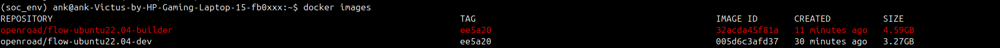
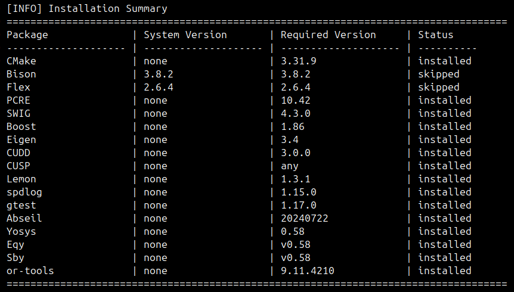
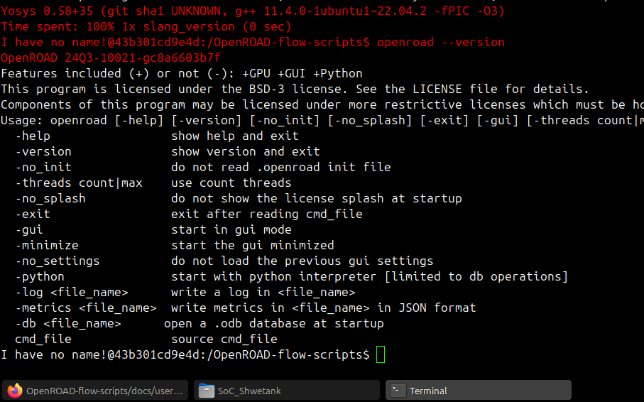
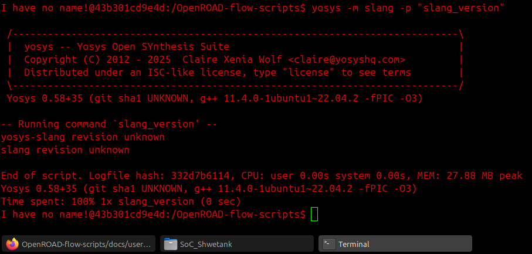
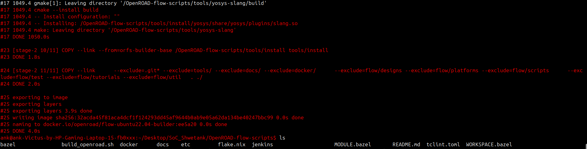
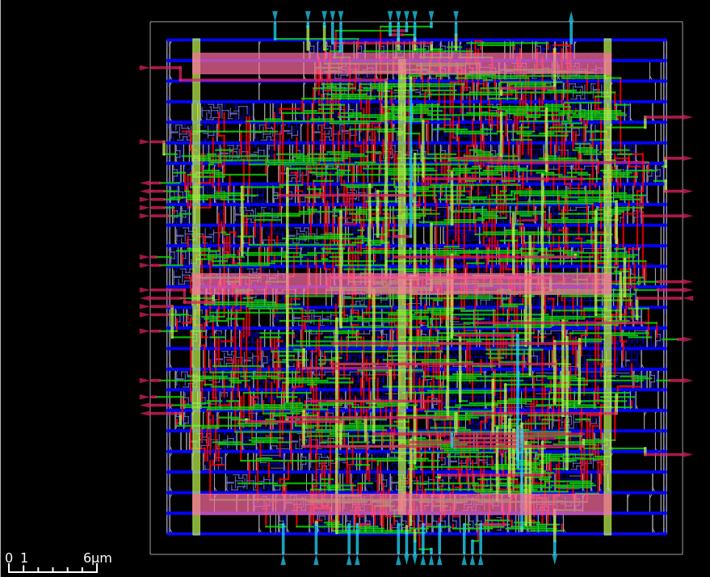
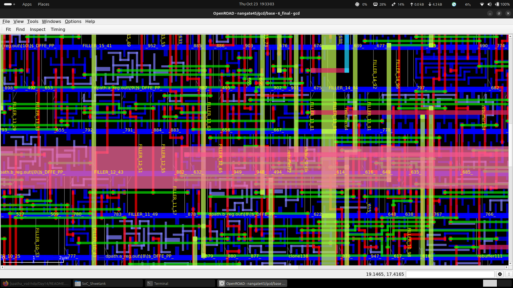
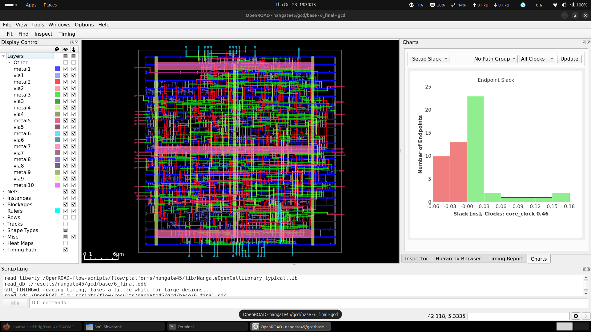
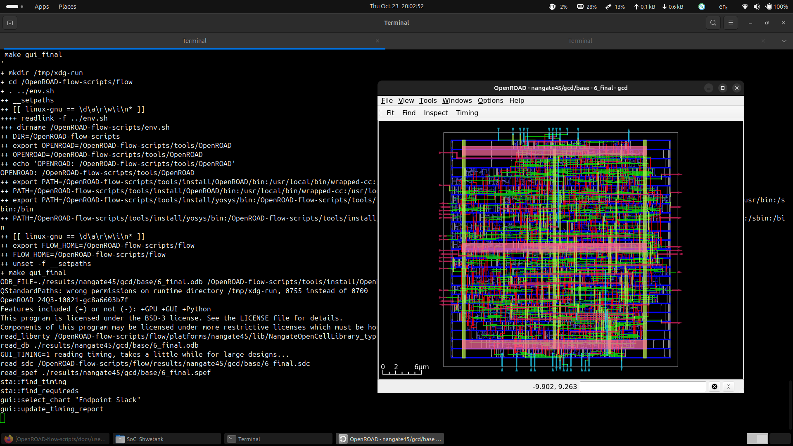
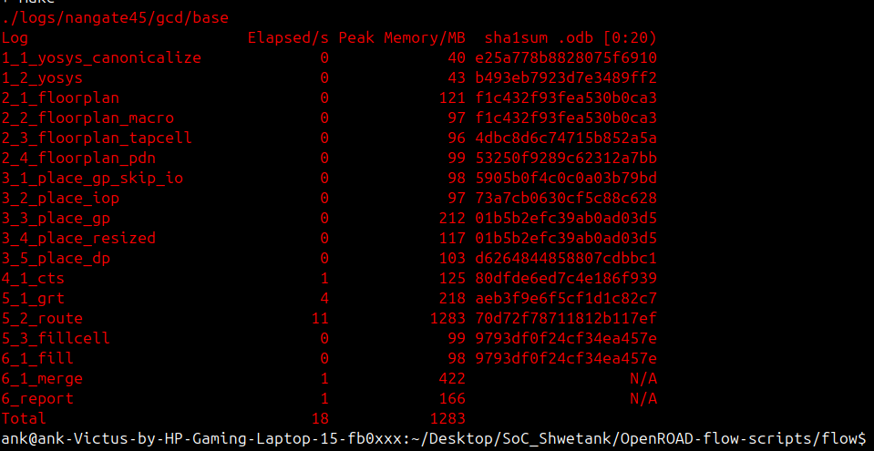

# Week 5: OpenROAD Flow Setup and Floorplan + Placement

## Table of Contents

- [Introduction](#introduction)
- [Objectives](#objectives)
- [Prerequisites](#prerequisites)
- [Installation](#installation)
  - [Prerequisites](#prerequisites-1)
  - [Build Using Docker from Sources](#build-using-docker-from-sources)
  - [Verification Screenshots](#verification-screenshots)
- [Execution](#execution)
  - [Key Flow Stages (Up to Placement)](#key-flow-stages-up-to-placement)
  - [Running the Flow](#running-the-flow)
  - [Challenges and Resolutions](#challenges-and-resolutions)
- [Results](#results)
  - [Logs and Outputs](#logs-and-outputs)
  - [Visual Outputs](#visual-outputs)
  - [Key Metrics](#key-metrics)
  - [Generated Files from Flow](#generated-files-from-flow)
- [Deliverables](#deliverables)
- [Conclusion](#conclusion)
- [References and Citations](#references-and-citations)

## Introduction

Week 5 focuses on transitioning from transistor-level SPICE simulations (as covered in WEEK_4) to backend physical design implementation. This week introduces OpenROAD, an open-source Electronic Design Automation (EDA) tool suite for RTL-to-GDSII flows. The primary activities involve setting up the OpenROAD Flow Scripts (ORFS) environment and executing the Floorplan and Placement stages of the physical design flow. These stages are critical for understanding how logical designs are physically realized on silicon, including core area definition, power grid setup, and standard cell placement to optimize for timing, area, and congestion.

This README provides a detailed, technical overview of the week's objectives, installation process, execution steps, results, and deliverables.

## Objectives

The key objectives for Week 5 are:

1. **Install OpenROAD Flow Scripts**: Clone, build, and verify the OpenROAD Flow Scripts repository on a Linux system, ensuring all prerequisites (e.g., Docker, dependencies) are met for a functional environment.
2. **Execute Floorplan and Placement Stages**: Run the OpenROAD flow up to and including the Floorplan and Placement stages. This includes:
   - Floorplanning: Defining die dimensions, core area, I/O placement, tap cells, and power distribution network (PDN).
   - Placement: Global placement, I/O placement, detailed placement, and resizing for optimization.
3. **Verify and Document**: Confirm successful execution through logs, generate visual outputs (e.g., floorplan and placement layouts), and document challenges, resolutions, and key learnings.

By completing these objectives, we gain hands-on experience with open-source ASIC design tools, bridging RTL design with physical implementation.

## Prerequisites

The following prerequisites are necessary for setting up and running the OpenROAD Flow Scripts:

- **Operating System**: Linux (e.g., Ubuntu 22.04, as evidenced by Docker image, like `openroad/flow-ubuntu22.04-builder`).
- **Tools and Dependencies**:
  - Docker (version 28.5.1 or compatible, as shown in logs).
  - Git for cloning repositories.
  - X11 for GUI support (e.g., for OpenROAD GUI visualization).
  - System packages: Ensure `xauth`, `libgl`, and related libraries are available for GUI rendering.
- **Hardware**: Sufficient RAM (logs show peak memory usage up to 1283 MB during routing, but placement stages are lower) and CPU for compilation and execution.
- **User Setup**: Non-root user with Docker permissions (logs show user ID 1000:1000).

## Installation

The installation follows the steps outlined in `Reference/README_week_5_reference_2.md` and verified in `logs/log_2.md`.

### Prerequisites

- Install [Docker](https://docs.docker.com/engine/install) on your machine.
- Ensure sufficient memory allocated to the VM as per system requirements. Refer to [Docker guide](https://docs.docker.com/config/containers/resource_constraints/) for CPU cores and memory limits.
- Note: `build_openroad.sh` uses the host number of CPUs. Check with `docker run --rm ubuntu:22.04 nproc` and restrict CPUs if needed.

### Build Using Docker from Sources

1. **Clone the Repository**:
   ```bash
   git clone --recursive https://github.com/The-OpenROAD-Project/OpenROAD-flow-scripts
   cd OpenROAD-flow-scripts
   ```
   This clones the ORFS repository with submodules.

2. **Build OpenROAD**:
   ```bash
   ./build_openroad.sh
   ```
   Compiles OpenROAD tools. Use `--threads N` to restrict CPUs. Successful build results in binaries in `tools/install/`.

3. **Verify Installation**:
   - Start a container:
      ```bash
      docker run --rm -it -u $(id -u ${USER}):$(id -g ${USER}) -v $(pwd)/flow:/OpenROAD-flow-scripts/flow openroad/flow-ubuntu22.04-builder:TAG
      ```
      

      - Inside Docker:
         ```bash
         source ./env.sh 
         yosys -help
         yosys -m slang -p "slang_version"
         openroad -help
         cd flow 
         make
         ```
   
   - Alternative:
      ```bash
      cd flow 
      util/docker_shell make
      ```

4. **Enable GUI Support**:
   - For Ubuntu/Debian: Run Docker with GUI flags:
     ```bash
     docker run --rm -it \
                -u $(id -u ${USER}):$(id -g ${USER}) \
                -v $(pwd)/flow:/OpenROAD-flow-scripts/flow \
                -e DISPLAY=${DISPLAY} \
                -v /tmp/.X11-unix:/tmp/.X11-unix \
                -v ${HOME}/.Xauthority:/.Xauthority \
                --network host \
                --security-opt seccomp=unconfined \
                openroad/flow-ubuntu22.04-builder:TAG
     ```
      - Then:
         ```bash
         source ./env.sh
         yosys -help
         yosys -m slang -p "slang_version"
         openroad -help
         cd flow
         make gui_final
         ```

   - Alternative:

      ```bash
      cd flow
      util/docker_shell make gui_final
      ```

### Verification Screenshots

-  
- Overview of setup completion.
-  
- OpenROAD Version check output.
-  
- Yosys version confirmation.
-  
- Build success indicator.

## Execution

Execution is performed in the `flow/` directory using the Makefile-based ORFS flow. Logs from `logs/log_1.md` and `logs/log_2.md` detail the process for the Nangate45 technology node on the GCD (Greatest Common Divisor) design.

### Key Flow Stages (Up to Placement)

The ORFS flow is automated via `make`. Relevant stages for Week 5:

1. **Synthesis (1_1_yosys_canonicalize, 1_2_yosys)**:
   - Converts RTL (Verilog) to gate-level netlist using Yosys.
   - Elapsed: 0s each, Peak Memory: 40-43 MB.
   - Output: Canonicalized and synthesized netlist.

2. **Floorplan (2_1_floorplan to 2_4_floorplan_pdn)**:
   - **2_1_floorplan**: Initializes floorplan, defines die and core areas.
   - **2_2_floorplan_macro**: Places macros (if any).
   - **2_3_floorplan_tapcell**: Adds tap cells for substrate biasing.
   - **2_4_floorplan_pdn**: Sets up power distribution network.
   - Elapsed: 0s each, Peak Memory: 96-121 MB.
   - Confirms core area and die dimensions are generated.

3. **Placement (3_1_place_gp_skip_io to 3_5_place_dp)**:
   - **3_1_place_gp_skip_io**: Global placement skipping I/O.
   - **3_2_place_iop**: I/O placement.
   - **3_3_place_gp**: Global placement.
   - **3_4_place_resized**: Resizing for optimization.
   - **3_5_place_dp**: Detailed placement.
   - Elapsed: 0s each, Peak Memory: 97-212 MB.
   - Standard cells are placed successfully, optimizing for wirelength and congestion.

Total time for these stages: ~0s (as per logs), with SHA1 checksums for .odb files ensuring reproducibility.

### Running the Flow

- Navigate to `flow/`: `cd flow`
- Execute: `make` (runs full flow, but stop at placement as per task).
- For GUI visualization: `make gui_final` (loads final .odb into OpenROAD GUI for inspection).
- Logs show successful runs, e.g., `./logs/nangate45/gcd/base` with step-by-step outputs.

### Challenges and Resolutions

- **Docker Permissions**: Logs show `groups: cannot find name for group ID 1000`, resolved by user mapping (`-u 1000:1000`).
- **GUI Launch**: Initial `gui_final` command failed (`command not found`), resolved by running `make gui_final` within Docker shell.
- **X11 Forwarding**: Set up with `xauth` and environment variables for GUI display.

## Results

### Logs and Outputs

- **Flow Logs**: `logs/log_1.md` and `logs/log_2.md` provide terminal outputs, including elapsed times, memory usage, and .odb checksums.
- **Generated Files**: Intermediate files in `results/nangate45/gcd/base/`, e.g., floorplan .odb, placement .odb.
- **Verification**: OpenROAD GUI loads successfully, displaying timing and layout.

### Visual Outputs

-  
- Die and core area layout.
-  
- Detailed floorplan view.
-  
- Final layout post-placement.
-  
- Run completion.
-  
- Summary of flow execution.

### Key Metrics

- **Core Area**: 645 um² (56% utilization) during floorplan, 668 um² (58% utilization) after detailed placement, 840 um² (73% utilization) final.
- **Placement**: Standard cells placed with optimizations for area and timing.
- **Memory/Power**: Peak 212 MB during placement, 170 MB during final report. Power: Total 4.03e-03 W (Internal 54.2%, Switching 45.3%, Leakage 0.6%).
- **Timing (Floorplan)**: TNS 0.00, WNS 0.00, Worst Slack 0.03, Clock Min Period 0.43ns (Fmax 2328.13 MHz). Power: Total 2.48e-03 W (Internal 59.0%, Switching 40.3%, Leakage 0.6%).
- **Timing (Global Placement)**: TNS 0.00, WNS 0.00, Worst Slack 0.04, Clock Min Period 0.42ns (Fmax 2383.41 MHz). Power: Total 2.68e-03 W (Internal 56.6%, Switching 42.8%, Leakage 0.6%).
- **Timing (Detailed Placement)**: TNS -0.01, WNS -0.01, Worst Slack -0.01, Clock Min Period 0.47ns (Fmax 2149.70 MHz). Power: Total 2.68e-03 W (Internal 56.5%, Switching 42.9%, Leakage 0.6%). 0 setup violations & 0 hold violations reported.
- **Timing (Final)**: TNS -0.52, WNS -0.05, Worst Slack -0.05, Clock Min Period 0.51ns (Fmax 1943.94 MHz). 23 setup violations & 0 hold violations reported.

### Generated Files from Flow

The OpenROAD flow generates intermediate and final files in `flow/results/nangate45/gcd/base/` and `flow/reports/nangate45/gcd/base/`. Key files include:

- **Synthesis**: `1_2_yosys.v` (gate-level netlist), `1_synth.v` (synthesized Verilog).
- **Floorplan**: `2_1_floorplan.odb` (OpenDB database), `2_floorplan.odb` (final floorplan).
- **Placement**: `3_5_place_dp.odb` (detailed placement), `3_place.def` (Design Exchange Format).
- **Reports**: `2_floorplan_final.rpt` (floorplan report), `3_detailed_place.rpt` (placement report).
- **Logs**: Individual `.log` files for each stage in `flow/logs/nangate45/gcd/base/`.
- **Visuals**: WebP images like `final_placement.webp`, `final_routing.webp` for layout visualization.

## Deliverables

1. **Screenshots/Snapshots**:
   - Terminal commands and outputs (e.g., from `logs/log_2.md`).
   - Linux username visible (e.g., `ank@ank-Victus-by-HP-Gaming-Laptop-15-fb0xxx`).
   - Installation success (assets above).
   - Floorplan/Placement logs and GUI views.

2. **Images/Outputs**:
   - Floorplan view (assets/Floorplan_main.png, Floorplan_zoom.png).
   - Placement layout (assets/OpenROAD_6_final-gcd.png).

    - Detailed view.

3. **Short Summary**:
   - Steps followed: Cloned ORFS, ran setup/build, verified tools, executed `make` up to placement, visualized with GUI.
   - Challenges: Docker user mapping and GUI command resolution via proper invocation.
   - Resolutions: Used user ID mapping and `make gui_final` in Docker shell.

## Conclusion

Week 5 successfully demonstrates the setup of OpenROAD Flow Scripts and execution of Floorplan and Placement stages, producing a physical layout ready for further backend steps. This hands-on experience highlights the importance of open-source tools in democratizing ASIC design, with logs and assets providing concrete evidence of a working environment. Future weeks will build on this foundation for routing and signoff.

## References and Citations

- OpenROAD Flow Scripts Repository: https://github.com/The-OpenROAD-Project/OpenROAD-flow-scripts.git
- OpenROAD Project: https://openroad.readthedocs.io/en/latest/
- Docker: https://www.docker.com/
